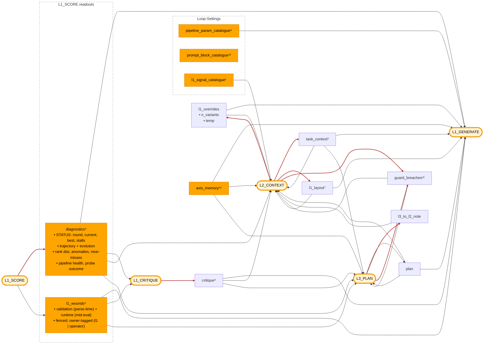

# Dispatch hub + L1 layout + L2 internals

Visual + reference for `promptpotter/application/optimization/dispatch/` — the registry that fills `{{placeholders}}` in the four optimizer prompts — and for `L1Layout`, the structural surface L2 edits to decide what L1_GENERATE sees. **L2_CONTEXT firing lives here too**, from § Trigger down: L2 is one entry in this hub — same `LayerStrategy` shape as L3, same `fill` path (from its `NODE_LAYOUTS["l2_context"].floor`), same `Bundle` per-call state, and the hub is what stops it accumulating its own renderers, surface object and escape hatches. Concept role: [`../concepts/the-loop.md`](../concepts/the-loop.md).

The hub is stateless. `INJECTIONS` is a typed `dict[str, _Injection]` — each entry carries `name`, `kind` (MEASUREMENT / DERIVED / TRACE / DIRECTIVE), `render: InjectionBundle → list[Item]`, a `char_cap`, a `citable` flag, and a `description` string, registered by the `@signal("<name>", …)` decorator at the renderer's definition site. `validate_template()` (called from `load_optimizer_prompt`) raises on `{{slot}}` names not in the registry: a typo in a template fails at module load, not at first render.

`citable` answers one question: may an `l1_generate` variant name this panel in `evidence_grounding`? True for panels that REPORT (what was measured, what failed, what the layers steered); False for the value-space menus and the prompt under edit — citing those grounds a mutation in its own subject. `citable_fields(layout, exploration_budget)` intersects the flag with the node's **live layout**, so what L1 may cite is exactly what L1 was shown; the same call fills the prompt's `{{citable_fields}}` menu, the wire schema's enum, and the `evidence_grounding_present` check. Adding a panel to a floor makes it citable automatically.

## Flow

Inputs (left) fill placeholders in optimizer process nodes (right).

- **Amber pill** — optimizer process node: the four LLM prompts (L1_GENERATE, L1_CRITIQUE, L2_CONTEXT, L3_PLAN) plus L1_SCORE (deterministic).
- **Solid orange** — deterministic input (schema, measurements, counters, constants).
- **Default node** — AI-generated input (content originates from another LLM stage).
- **Red arrow** — LLM-produced edge: the feedback loops that close the optimizer. L1_SCORE outputs (`diagnostics`, `l1_wounds`) are computed, so they draw in normal color. `guard_breaches` (post-parse validators on L2's / L3's own output) is LLM-produced, so its producer edges are red.



## Reference

**The registered signals** are every `@signal(…)` across four modules (`injections/layer_state.py` · `panels.py` · `catalogues.py` · `wounds.py` — each renderer is its slot's SoT), plus 2 caller extras (`n_variants`, `citable_fields`). The highest-traffic slots are detailed below, grouped by role; numbered items map to the diagram superscripts. `[fenced]` = output wrapped in `<UNTRUSTED_DATASET_CONTENT>` (echoes raw query + GT text — the STATUS prefix on `diagnostics` is plain, only the dataset-content body is fenced). 🧩 follows every sub-member name — companion to the inline expansion the diagram does for `l1_overrides` (`n_variants`🧩, `creativity`🧩); lets you scan for atomic field names regardless of which placeholder owns them.

### Every item that reaches an LLM carries an upper limit — bounded where it is PRODUCED

**No injectable is unbounded, and a `char_cap` alone does not bound one.** A cap is a render-side backstop; the limit has to exist at the site the text is *authored*, because that is the only place an overlong item can be judged **faulty** rather than quietly shortened. Truncating at render turns a producer's fault into a silent content loss with nobody at fault — `l3_plan` arrived at ~3.2k against a 2000-char rail and the strategy's back five bullets vanished with every gate green.

So each item is bounded twice, and the two must agree:

| where it is produced | the bound that judges it |
|---|---|
| an LLM optimizer output (`plan`, `critique`, an L2/L3 field) | `max_length` + a `_truncate*` validator on the response model (`dispatch/schemas.py`) — the parse boundary, where over-budget is the producer's fault |
| operator-authored framing (`task_context`) | `TaskDecomposition.check_budget` at mint — per field **and** in total, so five legal fields cannot compose an illegal framing |
| a derived/measurement view | its own `*_RENDER_CAP` top-K, which bounds rows rather than characters |

`char_cap` then catches only what those missed, and only where the composition CANNOT thin — a runaway backstop on the four indivisible panels, nothing more. No other panel carries one: a production cap pre-decides how much a panel takes against a ceiling the panel cannot see, and a set of such caps chosen one at a time has a sum nobody owns. `mutation_memory` renders **newest round first** so that what the ceiling drops is the OLDEST attempt — the record that stops round 4 re-proposing round 1 is the one worth keeping.

**The composition owns the budget, the fence and the count — because a panel can see none of them.** Renderers hand back `list[Item]`, each item `(text, trusted)`; `compose.select` takes each panel's next item in layout order, round after round, until `OPTIMIZER_PROMPT_BUDGET_CHARS` is spent. So every panel places its first item before any panel places its second, and no panel can crowd the package by being large. **Selection drops whole items and never slices one**: shedding half a panel chooses which half the model sees, while dropping an item leaves a smaller COMPLETE package. Three things follow, and none of them is a renderer's to do:

- **The fence is emitted around each contiguous untrusted run at collapse time**, so an unbalanced tag is structurally impossible rather than repaired by a backstop. A renderer that bakes its own cannot know where the selection will cut, and an unterminated fence lets sample text run loose to the end of the prompt — a prompt-injection surface, not a lost paragraph. Grouping also means ten untrusted rows pay for one fence.
- **Row granularity is what stops starvation.** A panel handing back one large fenced block cannot be thinned, only starved whole, while every smaller panel around it arrives intact.
- **A panel states what it HAS; the composition states what it SHOWED** — a panel cannot see the selection that comes after it, so it has no `(+N not shown)` line to write.

Which panels may be thinned is `InjectionKind.divisible`, asked of the kind every signal already declares: MEASUREMENT and DERIVED are evidence and thin gracefully; TRACE and DIRECTIVE carry state and are placed whole or not at all. Asked of the kind rather than of a set of names, because a set silently skips whatever it failed to list — and the prompt under edit reaching a whole-field-replacing generator with a field missing is the expensive form of that.

So: bound it where it is written, cap it where it is rendered, and let the composition spend what is left. `prompt_chars` stays the measurement, and what selection dropped rides beside it.

Each entry in `INJECTIONS` is a frozen `_Injection(name, kind, render, char_cap, citable)` — `char_cap` set only on the indivisible panels. `kind` is one of:

- **MEASUREMENT** — deterministic round-end output (e.g. `diagnostics`, `l1_wounds`, `guard_breaches`).
- **DERIVED** — view/digest over MeasurementArchive or AxisIndex (e.g. `axis_memory`).
- **TRACE** — narrative state from prior LLM calls (e.g. `critique`, `plan`, `task_context`).
- **DIRECTIVE** — short-lived directive consumed by exactly one downstream layer (e.g. `l3_to_l2_note`).

### Round-end measurement — what L1_SCORE + L1_CRITIQUE leave behind

This is where the reader's mental model of a round usually starts: candidates were scored, results condensed, critique produced. These outputs are what the next round's prompts read.

- ⁴ **`diagnostics`** ← STATUS prefix (plain) + fenced `RoundDiagnostics` body
  - **STATUS prefix** ← `bundle.cycle_slice` — `round`🧩, `current`🧩 (parent fitness `f"{cs.current_accuracy:.1%}"`), `best`🧩 (acc + round), `L1 stall`🧩 (rounds), and — when fired — `L2 fired`🧩 (count + stall), `L3 fired`🧩 (count + stall). Plain text (cycle counters are trusted optimizer state, not untrusted dataset content). Always renders, including pre-round-1 when `digest.diagnostics is None`. Despite the `current`/`best` accuracy labels, the rendered values are mean composite *fitness* under the active scorer, not hit-rates.
  - **Body** [fenced] ← `bundle.digest.diagnostics`: `RoundDiagnostics` from `compute_round_diagnostics` (built deterministically by L1_SCORE) — trajectory + recent-rounds evolution, anomalies, rank dist + top-k, pipeline-health termination split, failures by step / warning class, near-misses, cross-candidate diff, diversity, cache-share, miss-sample, prompt-size warning, probe outcome 🧩
- ⁵ **`l1_wounds`** [fenced] ← `opt_sp.wounds.{validation_failures, runtime_failures}` · L1-owned wounds, one block
  - **Validation** (parse-time): `axis`🧩, `value`🧩 (LLM-proposed), `allowed`🧩, `reason`🧩 — from `L1_SCHEMA_COMPLIANCE`; synthetic-0 per-candidate, except `reason=hallucinated_node` which is non-fatal routed signal.
  - **Runtime** (mid-eval): per-candidate `DegradationCheck` evidence, owner-tagged (`owner=l1` retune · `owner=operator` flagged, not in-loop fixable); accumulates cross-round (NEW vs ACCUMULATED).
  - Fenced (echoes arbitrary LLM output + pipeline warnings). Renderer `_r_l1_wounds`.
- ¹² **`guard_breaches`** ← `opt_sp.wounds.{l2_guard_breaches, l3_guard_breaches}` · post-parse breaches, both owner=L3 (replan)
  - Plain (only `validator_id`🧩 from a controlled registry — no untrusted content). Renderer `_r_guard_breaches`.
  - Set by L2/L3 post-parse validators. A non-empty L2 block force-triggers an immediate L3 fire (read off the stream by `escalate_l2`, not this render); L3 also reads its own past breaches to avoid repeating them.
- ⁸ **`critique`** ← `bundle.digest.critique` (L1_CRITIQUE output, consumes ⁴ + ⁵)
  - Compact view via `format_l1_critique_for_prompt`
  - `summary`🧩, `priority_fix`🧩, `suggested_axes`🧩, `failure_highlights`🧩 (top 5)

### Strategic injects — L3_PLAN writes, L2_CONTEXT refines, persistent

- **`plan`** ← `opt_sp.plan` · L3_PLAN-only writer; never cleared.
- ³ **`task_context`** ← `opt_sp.task_context`
  - 5 rendered fields: `domain`🧩, `pipeline_purpose`🧩, `data_characteristics`🧩, `optimization_goals`🧩, `key_challenges`🧩
  - Seeded by `checkin` decomposition at `init`; L2_CONTEXT merges on each fire — broadcast to every layer as the persistent task framing
  - `raw_description`🧩 renders nowhere. `upstream_context`🧩 / `downstream_context`🧩 skip THIS panel but splice around `problem_description` into the TARGET prompt (`_field_value`) — even an empty one, which is why they are the half L1 may mutate and have a scored effect
- **`l3_to_l2_note`** ← `opt_sp.wounds.l3_note` · L2_CONTEXT template only; explicitly excluded from L1_GENERATE.

### Cross-round derived

- ¹⁴ **`axis_memory`** (DERIVED) ← `cycle.axes.digest()` — AxisIndex per-axis effect_size + sample-coverage; consumed by L1_GENERATE, L2_CONTEXT, L3_PLAN. Empty when AxisIndex isn't yet initialised (round 1).
- **Panels family** (`injections/panels.py`, DERIVED views; each renderer is its slot's SoT): `escalation_panel` (L1 stall depth + `exploration_budget` — gates the `stall_exploration` citation), `evidence_health` (per-node failure rates — flags an evidence-starved enricher), `answer_distribution` (what the pipeline ANSWERS vs what is true, as label tallies, plus the score a constant single-label answer would earn — the collapse detector; empty on free-text answer spaces. It renders the rule but no longer owns it: `domain/scoring.py::enumerable_truth_labels` is the one definition of "is there a constant to detect here", shared with the scoring gate that withholds θ from a collapsed candidate and with PoBB, which eliminates it), `failing_samples` (every current miss, one line each, ordered easiest-first on the cycle's locked δ ruler — which samples are still failing, how hard each is, what was answered vs what was true), `mutation_memory` (what this cycle has ALREADY tried: the changed field and its value, what it scored against its own matched origin, how it ended — keyed on the payload, never on the LLM's `changes_description`), `origin_strengths` (what the round-0 origin already scores, the floor variants must preserve), `archive_top_runs` (top-K historical runs on this dataset), `rare_hit_samples` (samples cracked by ≤3 of ≥10 attempts). Beside them the **decision frame** — short, self-suppressing, and the half a reader needs before any of the above means anything: `measurand` (the active composite formula and where the round landed on it), `precision` (that level's error bar, the arms' intervals, and the scale they were read on), `detectable_move` (the smallest gain this round could tell from zero — the CONTRAST se, since an edit is judged against the incumbent), `sample_provenance` (n, frozen-vs-adaptive subset, overlap with the last round, where PoBB cut each arm), `confounds` (cold ruler / collapsed δ band / subset moved whole — MEASURED, not warned about in advance), `budget_state` (rounds and spend left; the one non-citable member, since budget never argues that a mutation is right).
- **Capability directives** (`injections/layer_state.py`): `rebase_capability` / `terminate_capability` (conditional escape-hatch instructions into L2+L3 prompts; render empty when the config knob is off so ablation prompt bodies stay bit-identical). They **ride the layout channel** — on the `l2_context`/`l3_plan` floors AND mandatory sets, so an L4 layout edit that excises one rolls back to the floor (`validate_l1_layout`); no prose `{{token}}` carries them, so a prose rewrite *cannot* drop them. The config bit is the one sanctioned way to silence a directive. The base optimizer prompts' remaining prose tokens are the INLINE caller extras (`{{n_variants}}`, `{{citable_fields}}` on `l1_generate`) — ports that can never ride layout (they sit mid-sentence), guarded instead by `L1_PROMPT_PLACEHOLDERS_INTACT` → `dropped_mandatory_placeholder` (synthetic-0), checked on the MERGED params so inherited breakage flags too.

### Current state

- **`rendered_prompt`** ← `opt_sp.render_fields()` **⊕ `effective_optimizer_prompts(pipeline_schema, pipeline_params)`**
  - Both halves render one LABELLED section per field — `[field]` for the target prompt, `[node.field]` for the inner optimizer prompts. The override schema keys on those names, so a blob asked the generator to attribute a paragraph the render had just stripped the boundary from; it guessed, swept in neighbours, and since the fields concatenate verbatim they shipped twice. The labels come off `render_fields()`, the same walk `render()` joins, so one cannot claim a boundary the other lacks.
  - Structurally L1_SCORE's output: each round's winner becomes next round's `opt_sp`, so its render is the next parent prompt. The cycle lives in orchestration, not the diagram.
  - The panel is **the artifact under edit**, and on the recursion that is not the searchpoint: an L4 outer point's prompt fields reach no node (`prompt_node_names()` is empty there), while the real levers are the inner nodes' own `PromptTemplate` fields carried as `pipeline_params`. Both halves render, each empty where it is not the mutation surface — so a normal campaign is bit-identical and L4 stops rendering a MANDATORY panel as nothing. Base ⊕ the incumbent's adopted overrides, whole fields only: every mutation here is a complete-field replacement, so a truncated render would be worse than an absent one (hence the cap sits above the recursion's own ~10k bundle).
- ⁹ **`pipeline_param_catalogue`** ← attributes on `pipeline_schema`: `node_param_keys`🧩, `param_allowed_values`🧩, `param_descriptions`🧩, `available_models`🧩
- ¹³ **`prompt_block_catalogue`** ← `config/prompt_variants.json` (`prompt_blocks()`), gated by `OptimizationConfig.prompt_block_catalogue`. The value space of a prompt FIELD, as `pipeline_param_catalogue` is the value space of a pipeline PARAM. `guidance` (default) offers the blocks as reusable material L1 may adapt or ignore; `restrict` closes the field to the library (an off-library value fails `L1_PROMPT_BLOCKS_IN_LIBRARY` → synthetic-0 → L2 wound, the same shape as a forbidden axis); `off` renders empty, leaving the prompt bit-for-bit identical to a no-library ablation.
  - ≤4 enum values per param, ≤40-char description fallback, ≤8 models
- **`l1_overrides`** ← `opt_sp.l1_overrides`
  - Bundles two L2_CONTEXT-set knobs that govern *how L1_GENERATE runs*, not what L1_GENERATE puts in candidates: `n_variants`🧩, `creativity`🧩
  - `n_variants`🧩 enters L1_GENERATE only via the `{{n_variants}}` caller extra (a directive — L1_GENERATE obeys)
  - `creativity`🧩 sets the L1_GENERATE LLM call's temperature; never reaches the prompt text
  - Field, injection, and placeholder all share the name `l1_overrides`
- ⁷ **`l1_layout`** ← `opt_sp.l1_layout` · the one name that is BOTH a structural input and a signal
  - L2_CONTEXT-only writer; consumed by `DispatchHub.fill` as `l1_generate`'s per-slot injection-name list that drives the slot walk (every node's layout comes from `NODE_LAYOUTS[node]`; `l1_generate`'s is L2-overridden via this field)
  - Decides *which* injection renderings land in each L1 addressable slot (`persona`🧩, `task_intent`🧩, `problem_description`🧩, `thinking_style`🧩) — content is rendered separately by the listed injections' `_r_*` functions
  - Registered too, on `l2_context`'s floor only — the writer's view of what it is about to overwrite, the twin `l1_overrides` always had. An edit is per slot and the floor packs 12 of 13 signals into one, so a blind writer drops whatever it fails to restate

### L2_CONTEXT / L3_PLAN-internal

- ¹ **`l1_signal_catalogue`** ← `NODE_LAYOUTS["l1_generate"].mandatory` (`domain/l1_layout.py`) · the one layout rule no JSON Schema can state — after an edit is applied, each mandatory signal must still sit under SOME slot. It binds the MERGED layout, which is what `validate_l1_layout` is handed, so it constrains what an edit may take AWAY and never asks L2 to restate slots it is not changing. The slots and the signal enum ride `l1_layout`'s own schema (`layout_json_schema`, one builder shared with L4's per-node `layout`), so this panel names neither.

### Caller extras — L1_GENERATE template scalars (`l1/generate.py`)

Substituted directly by `compile_prompt`; not signals.

- **`n_variants`** ← `min(opt_sp.l1_overrides["n_variants"], opt.n_variants × 3)` · directive — L1_GENERATE obeys.

## Mechanics

- **Entry points** — two, both stateless: `render(name, bundle)` (internal, one injection's text) and `fill(template, layout, bundle)` (**every** optimizer node). `InjectionBundle` is the per-call frozen state `(opt_sp, pipeline_schema, cycle_slice, digest)`, built once via `build_bundle(cycle)`; `digest` is a `RoundDigest(diagnostics, critique)` — the post-scoring compression chain in one place, so renderers read through it instead of off two parallel `latest_*` fields.
- **Fill** — one path for every node: `fill(template, layout, bundle)` walks the node's layout (per-slot injection-name lists — `l1_generate`'s from `opt_sp.l1_layout`, the rest from `NODE_LAYOUTS[node].floor`), appends rendered injection text to each addressable slot, then scans the filled body for any `{{name}}` left in non-layout prose (`instruction`/`answer_format`) and renders the `INJECTIONS` ones into a kwargs dict → `(filled_template, injection_vars)`. The four optimizer prompt `problem_description` bodies are now empty strings (their `{{tokens}}` moved into `NODE_LAYOUTS`), and **no optimizer prose token names an injection any more** — every surviving `{{token}}` in the shipped prompts is a caller extra (`n_variants`, `citable_fields`, `consultation_instruction`). The `l2_context` instruction kept `{{rebase_capability}}`/`{{terminate_capability}}` after that move, so both directives rendered TWICE in every L2 prompt (~1.5k of ~10.9k chars, measured on the banked ledgers) — deleted; the layout channel is the only one. `validate_template()` (called from `load_optimizer_prompt`) errors at module load if any remaining `{{slot}}` is not in the `INJECTIONS` registry.
- **L1_GENERATE visibility** — `L1_POSSIBLE` (`domain/l1_layout.py`) is the whole menu 🧩; the rest (`l3_to_l2_note`, `l1_overrides`, `l1_signal_catalogue`, `guard_breaches`, the capability directives) are L1_CRITIQUE / L2_CONTEXT / L3_PLAN-internal — L2-internal signals are excluded so L1 can't see L2's own state.
- **L1_GENERATE guard** — every name in `L1_MANDATORY` (`domain/l1_layout.py`) 🧩 must sit across the 4 addressable slots once an edit is merged; missing fires `l1_layout_missing_mandatory` — a guard breach that routes to L3_PLAN (replan) rather than letting L2_CONTEXT starve L1_GENERATE. Membership is two kinds, and the second is the one that gets forgotten: a field L1 cannot OPERATE without (parent prompt, plan, task framing, mutation surface, failure digest), and the sole carrier of a state L1 must not enter BLIND — `answer_distribution`, without which a collapse onto one label is invisible to the very run collapsing, and `measurand` + `confounds`, without which the generator optimises a column it cannot name and reads a cold ruler or a collapsed band as ability.

## L1 layout — L2's structural edit surface

L1_GENERATE's prompt is composed by walking a per-slot list of **injection names** and resolving each through the registry above. L2 owns the layout; the registry is closed and code-derived. Concept role: [`the-loop.md`](../concepts/the-loop.md).

```
┌─ L1's prompt composition ──────────────────────────────────┐
│  PromptTemplate (l1_generate)        per-slot static text  │
│      +                                                     │
│  L1Layout (on OptSearchPoint)    per-slot injection lists  │
│      ↓                                                     │
│  DispatchHub.fill                    resolves names via    │
│                                      INJECTIONS registry   │
│      ↓                                                     │
│  RENDERED L1 PROMPT (what the LLM sees)                    │
└────────────────────────────────────────────────────────────┘
```

`L1Layout` (`promptpotter/domain/l1_layout.py`) is a Pydantic model with one list per addressable slot: `persona`, `task_intent`, `problem_description`, `thinking_style` (all L2-mutable). `answer_format` is omitted on purpose — it carries L1's output JSON schema (a code contract), not L2's call. Static text in each slot stays; the layout's injection renderings are appended. Renderers are layer-agnostic — the same `plan` renderer feeds L1, L2, and L3; if an injection needs to differ per layer, that's two injections.

**Default floor** (`default_l1_layout` = `NODE_LAYOUTS["l1_generate"].floor`): `task_context` in `task_intent`; `rendered_prompt`, then the decision frame (`measurand`, `precision`, `detectable_move`, `confounds`, `sample_provenance`), then `pipeline_param_catalogue`, `prompt_block_catalogue`, `plan`, `answer_distribution`, `critique`, `failing_samples`, `inner_narratives`, `mutation_memory`, `l1_wounds`, `escalation_panel`, `origin_strengths`, `budget_state` in `problem_description`. **Order is now priority in a second sense**: the composition selects section by section in layout order under the node's ceiling (`dispatch/compose.py`), so the frame is placed before a large panel can crowd it. `answer_distribution` leads the evidence because it frames everything after it: a pipeline collapsed onto one label needs that break, not a better-argued instruction, and no other panel can say so. `sample_transcripts` stays OFF the floor — it is the same misses at ~5x the bytes, and the generator reading it beside the critique duplicated a ~10k payload every round; `failing_samples` is its dense peer. Raw `diagnostics` and the cross-run panels stay off the floor too (critique distils them); L2 adds them on stall via its layout edit, and L4 optimises that authoring — every L2 fire in the first banked run touched the layout, so treat the floor as what a *first* L1 round reads, not as what most rounds read.

**Validation — split HARD / SOFT.** `validate_l1_layout(layout, *, spec, prior_layout)` enforces against the node's `NodeLayoutSpec` (`spec.mandatory`/`spec.possible`):

- HARD — missing mandatory placeholder, name outside the node's `possible`, duplicate within a slot, **duplicate across slots**. Caller rolls back to the prior layout / floor; outcomes append to the guard-breach wound stream for self-healing on the next L2 fire.

**A signal may sit in at most ONE slot, and that is a HARD check rather than a render-time dedup.** `all_placeholders()` concatenates the per-slot lists and `fill` appends one render per occurrence, so a name in two slots is emitted twice verbatim — and no `char_cap` can see it, being applied per render. Measured over 135 banked `l1_generate` prompts before `l1_layout_dups_across_slots` existed: 28% carried a verbatim second copy, median 2,414 wasted chars and up to 12,242, which is 6.3% of every character ever sent to the node and the whole of its over-budget cohort. It is rejected at the producer because the fault is an illegal layout L2 authored, not a render that obeyed one; the rule is also stated in `layout_json_schema`'s description, since that string is the only vocabulary the emitter is shown.
- SOFT — layout unchanged from prior. Applied with a warning; flagged `score=0.5` so L3 sees the churn signal next replan.

L2's parser (`escalation._parse_l2`) coerces `{slot: [name, ...]}` into `L1Layout`, validates, and only writes the new layout to OSP when HARD checks pass.

**Adding an injection** → the golden-path recipe lives in [`adding-a-surface.md`](adding-a-surface.md).

**File-line anchors** — `INJECTIONS`: `dispatch/injections/registry.py` · `InjectionBundle`: `dispatch/bundle.py` · `DispatchHub` + `build_bundle`: `dispatch/facade.py` · `L1Layout`, `L1_POSSIBLE`, `L1_MANDATORY`, `L1_LAYOUT_SLOTS`, `default_l1_layout`, `validate_l1_layout`: `promptpotter/domain/l1_layout.py` · L1 compose path: `application/optimization/l1/generate.py::l1_generate` · OSP layout field: `OptSearchPoint.memory.l1_layout` (`domain/opt_search_point.py`, `L2L3Memory`).

## Trigger — when L2 fires

`Cycle.escalation` tracks per-layer counters. After every L1 round: improved best fitness → counters reset; otherwise `l1_stall_count++`, and when it hits `l1_patience`, L2 fires.

Three preemptors fire L2 *before* patience (rules in `escalation/rules.py`): `l1_mandatory_breach` (a dropped mandatory placeholder), `l2_axis_yield_drought` (no axis yields above noise), and `l1_evidence_starved` (a node failed across ~all of a round's samples — `evidence_starved_node` ≥ `EVIDENCE_STARVED_RATE`). The last is the self-heal-vs-HITL fork: a starved round routes to L2 not to chase it, but so L2 can read the `evidence_health` panel and either refine or **terminate** (§ Outputs → `terminate_proposal`). Deterministic rules only route; they never diagnose or stop — termination authority belongs to the most-general reader, and a backend-coupled deterministic check only WARNS.

Trigger gate: `escalation.escalate_l2`; the decision is recorded as `ResumeCheckpointKind.L2_ESCALATION_TRIGGER`, gated **ARCHIVAL** — the trigger is a fold over the cycle's escalation history (counters bump once per escalation *request* and reset on each fire), not a function of one round's measurements, which is what a replayer is pure over. On resume the counters are rebuilt by `EscalationFSM.from_ledger`, not re-derived; the trigger's scorer-dependence rides `improved`, hence the round measurements, whose own decisions are `REPLAYED`.

## Inputs — L2 via the hub

L2's injection set **is** `NODE_LAYOUTS["l2_context"].floor` (`domain/l1_layout.py`) — read the membership there, never from a copy on this page, because the copy is what went stale when the capability directives were wired in. It lives in that layout rather than as `{{tokens}}` in the template — its `l2_context/1` `problem_description` body is now empty. No L2-only surface object exists. L2 does not see `l2_guard_breaches` / `l3_guard_breaches` — when those appear, Wound 4 fires L3 immediately, so by L2's next fire L3 has already replanned and L2 reads the new `plan`.

One injection is L2-only: `l1_signal_catalogue` — the cross-slot mandatory rule, which `l1_layout`'s schema cannot express. The vocabulary itself (legal slots, signal enum) is on that schema, not here: while it was prose-only, L2 answered the gap by inventing a shape and the edit rolled back. Absent from `L1_POSSIBLE` so L2 cannot accidentally inject its own catalogue into L1.

## Outputs — what L2 writes

```json
{
  "axis_targeted": "...",
  "l1_layout": {"persona": [...], "task_intent": [...], ...},
  "l1_overrides": {...},
  "rationale": "...",
  "fork_proposal": null,
  "terminate_proposal": {"reason": "..."} | null
}
```

Every field is optional at the PARSE boundary — a missing one leaves the corresponding OSP state untouched, so an omission never costs the rest of the fire. Only the two LEVERS are optional to *write*: `l1_layout` (what L1 looks at) and `l1_overrides` (how hard it explores), and a fire touching neither is a wasted escalation, scored as one by `l2_targets_l1_surface`. The REASON — `axis_targeted` + `rationale` — rides every fire including a no-lever one, which is what `l2_rationale_substantive` and `l2_evidence_anchored` grade. `terminate_proposal` is the HITL exit: on evidence-starvation L2 emits it with an operator-actionable reason (the dead node + what to fix) and the cycle halts (`StopReason.ABORT`); the operator fixes the backend and resumes. Both control outputs are gated by their `OptimizationConfig` capability bit — see [`../../promptpotter/application/optimization/CLAUDE.md`](../../promptpotter/application/optimization/CLAUDE.md) § L2/L3 layer-control channel.

**Two fields this schema deliberately does not have.** `task_context` — the operator's framing is frozen for the run; L2 steers what L1 *looks at*, never rewrites what the operator wrote about the task. `action` (`normal_round` / `probe_round`) — probe rounds are not wired; the lever was removed rather than guarded because it selected samples by a warned-query set that is empty on every healthy run, so choosing it measured nothing. Both are stated on `L2ContextOutput` itself (`dispatch/schemas.py`), with the full history in [`../../promptpotter/application/optimization/CLAUDE.md`](../../promptpotter/application/optimization/CLAUDE.md) § Probe rounds.

`_parse_l2` (`escalation/firing.py`) constructs a `TransitionResult`:

- `axis_targeted`: prose naming the axis this fire routed the failure cluster to — its evidence anchor, read by `l2_evidence_anchored`. Deliberately **not** a steering surface: L1 reads its axes from `axis_memory`, which is derived from measurement.
- `rationale`: the diagnosis behind the fire, and the only thing separating a steer from a guess. Carried forward as `changes_description`; an absent one is REPORTED there, never replaced by a stand-in sentence, because the placeholder that once stood in its place made an undiagnosed fire read exactly like a diagnosed one and left the empty state visible only as a decimal in `review.md`.
- `l1_layout`: **a per-slot EDIT, not a replacement layout** — `coerce_l1_layout(raw, base=opt_sp.memory.l1_layout)` applies the named slots and keeps the rest, the same rule `resolve_node_layout` gives L4's `layout` param. The two seams ran opposite rules while sharing one schema sentence, so L2 changed the slots it meant to and silently lost every signal it had not restated; `mutation_memory` went that way on all 13 banked edits, which is how a round-4 candidate re-proposes round 1's measured failure with nothing to object. Then validated per § Validation above — HARD failures roll back to the prior, SOFT outcomes ride along on `opt_sp.memory.wounds.l2_guard_breaches`.
- `l1_overrides`: merged onto a `mutate()`-derived child OSP.

### How L2 steers L1

Two channels, both via OSP fields the hub reads:

| Channel | OSP field | L1 effect |
|---------|-----------|-----------|
| Attention | `memory.l1_layout` | `DispatchHub.fill` walks the layout and appends each named injection's rendering to its slot. Mutating the layout reshapes which injections L1 sees and where. |
| Exploration | `memory.l1_overrides` | Optimizer params for L1's next call — `n_variants` (in-prompt directive via the `{{n_variants}}` caller extra) and `creativity` (L1 LLM-call temperature, out-of-prompt). |

`task_context` is **not** a channel: it is operator-authored framing that L2 reads as evidence and cannot write. L2 also cannot edit L1's static template text and cannot toggle `answer_format` — those are code contracts. Anything L2 wants L1 to see must already be a registered injection (from `L1_POSSIBLE`).

### Side effects — `_apply_l2`

```python
if result.l1_layout is not None:
    osp.memory.l1_layout = result.l1_layout
osp.memory.wounds.l2_guard_breaches = list(result.l2_guard_breaches)
cycle.escalation.record_l2_fired(...)
```

That is the whole of `_apply_l2`. The OSP is mutable Pydantic; writes happen in place. `l1_layout` lives on `OptSearchPoint.memory` (an `L2L3Memory` bundle), so L3-spawned children inherit in-flight L2 edits via `copy_memory_to`. `task_context` is on the same bundle and is forwarded by `mutate()` to L1 children (along with `l1_overrides`); the other two memory fields (`wounds`, `l1_layout`) reset to defaults in `mutate()` and instead carry forward when a child is **adopted** as the cycle's incumbent — the one `Cycle.adopt` seam (an L1 win and an L2/L3 transition alike) runs `copy_memory_to` from the outgoing incumbent, then overlays only the surface the adoption owns.

**No decision is recorded per L2 fire.** There was one — `PROBE_ROUND_COMMITMENT`, outcome `True` if probe — and it left with the probe lever; `ResumeCheckpointKind` no longer declares it. The L2 fire itself is on the ledger as `L2_ESCALATION_TRIGGER`; layout and exploration content are not separate decisions and ride on the round file.

## Wound 4 — L2 self-healing via L3

`l2_guard_breaches` holds L2's HARD layout breaches — the § Validation set above, plus `l1_layout_unparseable`, which `_parse_l2` emits when a non-empty edit coerces to no slot at all and the validator therefore never runs — and **any** breach after `_apply_l2` force-triggers L3 to heal. L2's own thrashing is observable to L3 via the `l2_guard_breaches` injection on its next fire.

**Every breach is hard — there is no soft-reject tier, and no `task_context` validator.** `task_context` framing is frozen for the run (`TaskDecomposition.merge` refuses a rewrite), so a stale-repeat breach is not representable and there is nothing inert to except: `escalation/firing.py` is an unconditional `if breaches:`. Do not add a tier to re-admit one.

**L2 file-line anchors** — `_parse_l2`, `_apply_l2`, `escalate_l2`, `TransitionResult`: `escalation/firing.py` (trigger gates in `escalation/decide.py`) · L2 prompt template: `assets/optimizer/pipeline.yaml::resolved_prompts['l2_context/1']` · OSP mutation surface: `domain/opt_search_point.py` (`task_context`, `l1_layout`, `l1_overrides`, `l2_guard_breaches`).

## Future — diagnostics vs l1_wounds

The wound-render merge is **done**: validation + runtime render as one `l1_wounds` block, and the two guard streams as `guard_breaches`. What stays distinct is `diagnostics` vs `l1_wounds` — `diagnostics` is per-round on `Bundle.digest` while the wound streams accumulate on `OptSearchPoint` cross-round, so a shared `MeasurementReadout` would either duplicate state into `RoundDigest` or move accumulating fields off OSP (breaking per-candidate attribution). Storage stays the three typed `WoundChannels` lists **deliberately** (`self-healing-internals.md`) — only rendering collapsed. Park the diagnostics↔wounds merge until the readout shapes stabilise.
