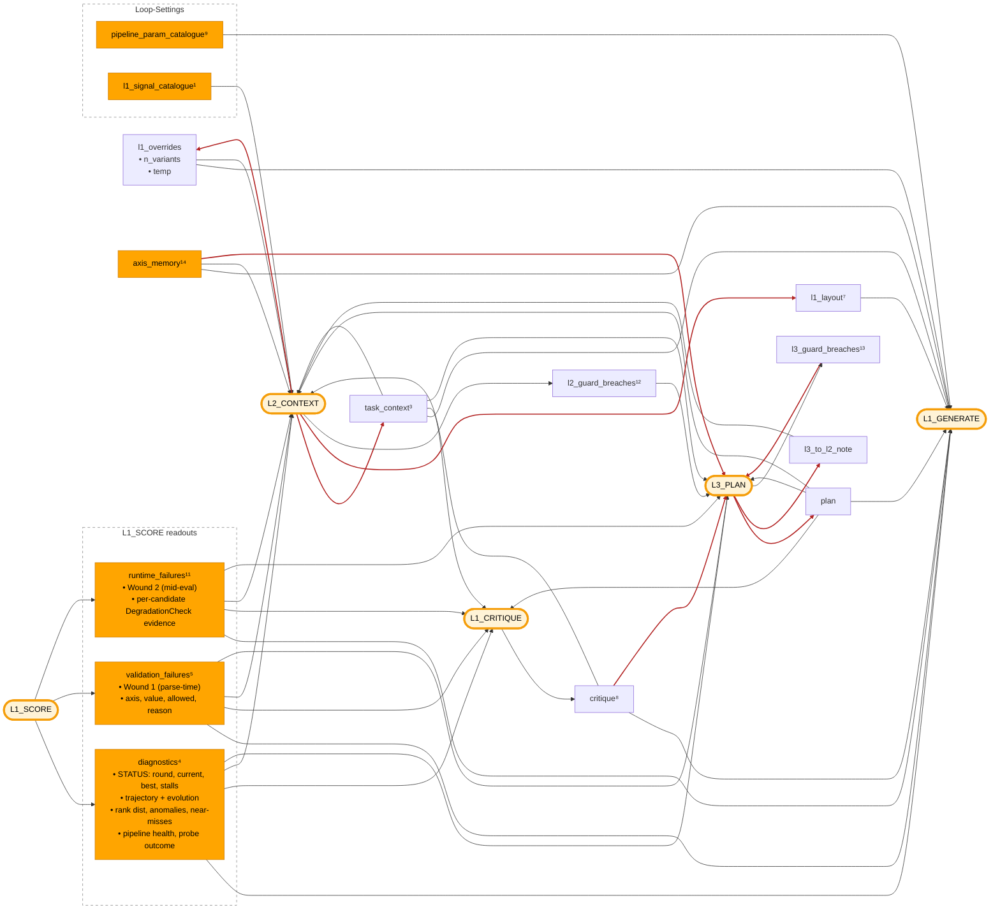

# Dispatch hub

Visual + reference for `promptpotter/application/optimization/dispatch/hub/` — the registry that fills `{{placeholders}}` in the four optimizer prompts. Pairs with [`l1-generate-surface.md`](l1-generate-surface.md) (L1_GENERATE's layout surface) and [`l2-internals.md`](l2-internals.md) (L2_CONTEXT firing).

The hub is stateless. `INJECTIONS` is a typed `dict[str, _Injection]` — each entry carries `name`, `kind` (MEASUREMENT / DERIVED / TRACE / DIRECTIVE), `render: InjectionBundle → str`, and a docstring. `validate_template()` (called from `load_optimizer_prompt`) raises on `{{slot}}` names not in the registry: a typo in a template fails at module load, not at first render.

## Flow

Inputs (left) fill placeholders in optimizer process nodes (right).

- **Amber pill** — optimizer process node: the four LLM prompts (L1_GENERATE, L1_CRITIQUE, L2_CONTEXT, L3_PLAN) plus L1_SCORE (deterministic).
- **Solid orange** — deterministic input (schema, measurements, counters, constants).
- **Default node** — AI-generated input (content originates from another LLM stage).
- **Red arrow** — LLM-produced edge: the feedback loops that close the optimizer. L1_SCORE outputs (`diagnostics`, `validation_failures`, `runtime_failures`) are computed, so they draw in normal color. `l2_guard_breaches` and `l3_guard_breaches` are LLM-produced (post-parse validators on L2's / L3's own output), so their producer edges are red.

## Reference

13 injections + 1 structural input + 1 caller extra, grouped by role. Numbered items map to the diagram superscripts. `[fenced]` = output wrapped in `<UNTRUSTED_DATASET_CONTENT>` (echoes raw query + GT text — the STATUS prefix on `diagnostics` is plain, only the dataset-content body is fenced). 🧩 follows every sub-member name — companion to the inline expansion the diagram does for `l1_overrides` (`n_variants`🧩, `creativity`🧩); lets you scan for atomic field names regardless of which placeholder owns them.

Each entry in `INJECTIONS` is a frozen `_Injection(name, kind, render, doc)`. `kind` is one of:

- **MEASUREMENT** — deterministic round-end output (e.g. `diagnostics`, `validation_failures`, `runtime_failures`).
- **DERIVED** — view/digest over MeasurementArchive or AxisIndex (e.g. `axis_memory`).
- **TRACE** — narrative state from prior LLM calls (e.g. `critique`, `plan`, `task_context`).
- **DIRECTIVE** — short-lived directive consumed by exactly one downstream layer (e.g. `l3_to_l2_note`).

### Round-end measurement — what L1_SCORE + L1_CRITIQUE leave behind

This is where the reader's mental model of a round usually starts: candidates were scored, results condensed, critique produced. These outputs are what the next round's prompts read.

- ⁴ **`diagnostics`** ← STATUS prefix (plain) + fenced `RoundDiagnostics` body
  - **STATUS prefix** ← `bundle.cycle_slice` — `round`🧩, `current`🧩 (parent fitness `f"{cs.current_accuracy:.1%}"`), `best`🧩 (acc + round), `L1 stall`🧩 (rounds), and — when fired — `L2 fired`🧩 (count + stall), `L3 fired`🧩 (count + stall). Plain text (cycle counters are trusted optimizer state, not untrusted dataset content). Always renders, including pre-round-1 when `digest.diagnostics is None`. Despite the `current`/`best` accuracy labels, the rendered values are mean composite *fitness* under the active scorer, not hit-rates.
  - **Body** [fenced] ← `bundle.digest.diagnostics`: `RoundDiagnostics` from `compute_round_diagnostics` (built deterministically by L1_SCORE) — trajectory + recent-rounds evolution, anomalies, rank dist + top-k, pipeline-health termination split, failures by step / warning class, near-misses, cross-candidate diff, diversity, cache-share, miss-sample, prompt-size warning, probe outcome 🧩
- ⁵ **`validation_failures`** [fenced] ← `opt_sp.wounds.validation_failures` · Wound 1 evidence
  - Each entry: `axis`🧩, `value`🧩 (LLM-proposed), `allowed`🧩, `reason`🧩. Fenced because `value` is arbitrary LLM output.
  - L1 parse-time deterministic validator (`L1_SCHEMA_COMPLIANCE`). Accumulates on `OptSearchPoint` cross-round.
- ¹¹ **`runtime_failures`** [fenced] ← `opt_sp.wounds.runtime_failures` · Wound 2 evidence
  - Per-candidate runtime failures from `DegradationCheck`; accumulates on `OptSearchPoint` cross-round.
  - Fenced because it echoes pipeline warning strings.
- ¹² **`l2_guard_breaches`** ← `opt_sp.wounds.l2_guard_breaches` · Wound 4 evidence
  - Plain (only `validator_id`🧩 from a controlled registry + `score`🧩 float — no untrusted content).
  - Set by L2_CONTEXT post-parse validators (`run_l2_output_validators`); non-empty triggers immediate L3 fire. **L3-only consumer** because L2 doesn't fire while these are outstanding (L3 replans first, then L2 fires fresh).
- ¹³ **`l3_guard_breaches`** ← `opt_sp.wounds.l3_guard_breaches` · L3 self-healing evidence
  - Plain (only `validator_id`🧩 + `score`🧩).
  - Set by L3_PLAN post-parse validators. **L3-only consumer** — L3 reads its own past failures to avoid repeating them on next replan.
- ⁸ **`critique`** ← `bundle.digest.critique` (L1_CRITIQUE output, consumes ⁴ + ⁵ + ¹¹)
  - Compact view via `format_l1_critique_for_prompt`
  - `summary`🧩, `priority_fix`🧩, `suggested_axes`🧩, `failure_highlights`🧩 (top 5)

### Strategic injects — L3_PLAN writes, L2_CONTEXT refines, persistent

- **`plan`** ← `opt_sp.plan` · L3_PLAN-only writer; never cleared.
- ³ **`task_context`** ← `opt_sp.task_context`
  - 5 rendered fields: `domain`🧩, `pipeline_purpose`🧩, `data_characteristics`🧩, `optimization_goals`🧩, `key_challenges`🧩
  - Seeded by `restructure` decomposition at `init`; L2_CONTEXT merges on each fire — broadcast to every layer as the persistent task framing
  - 3 model-only sub-fields skipped by the renderer: `raw_description`🧩, `upstream_context`🧩, `downstream_context`🧩
- **`l3_to_l2_note`** ← `opt_sp.wounds.l3_note` · L2_CONTEXT template only; explicitly excluded from L1_GENERATE.

### Cross-round derived

- ¹⁴ **`axis_memory`** (DERIVED) ← `cycle.axes.digest()` — AxisIndex per-axis effect_size + sample-coverage; consumed by L1_GENERATE, L2_CONTEXT, L3_PLAN. Empty when AxisIndex isn't yet initialised (round 1).

### Current state

- **`rendered_prompt`** ← `opt_sp.render()`
  - 8-field `PromptTemplate` compiled to one string
  - Structurally L1_SCORE's output: each round's winner becomes next round's `opt_sp`, so its render is the next parent prompt. The cycle lives in orchestration, not the diagram.
- ⁹ **`pipeline_param_catalogue`** ← attributes on `pipeline_schema`: `node_param_keys`🧩, `param_allowed_values`🧩, `param_descriptions`🧩, `available_models`🧩
  - ≤4 enum values per param, ≤40-char description fallback, ≤8 models
- **`l1_overrides`** ← `opt_sp.l1_overrides`
  - Bundles two L2_CONTEXT-set knobs that govern *how L1_GENERATE runs*, not what L1_GENERATE puts in candidates: `n_variants`🧩, `creativity`🧩
  - `n_variants`🧩 enters L1_GENERATE only via the `{{n_variants}}` caller extra (a directive — L1_GENERATE obeys)
  - `creativity`🧩 sets the L1_GENERATE LLM call's temperature; never reaches the prompt text
  - Field, injection, and placeholder all share the name `l1_overrides`
- ⁷ **`l1_layout`** ← `opt_sp.l1_layout` · structural, not an INJECTION
  - L2_CONTEXT-only writer; consumed by `DispatchHub.fill_l1` as the per-slot injection-name list that drives the slot walk
  - Decides *which* injection renderings land in each L1 addressable slot (`persona`🧩, `task_intent`🧩, `problem_description`🧩, `thinking_style`🧩) — content is rendered separately by the listed injections' `_r_*` functions
  - Not registered in `INJECTIONS`; never resolves a `{{l1_layout}}` placeholder. Shape-shifts L1's prompt rather than filling a slot in it

### L2_CONTEXT / L3_PLAN-internal

- ¹ **`l1_signal_catalogue`** ← sorted `L1_POSSIBLE` (`domain/l1_layout.py`) · menu L2_CONTEXT picks from when assembling L1_GENERATE's layout.
- **`prompt_budget_status`** (DERIVED) ← computed off `bundle.opt_sp` + the registry · L2_CONTEXT template only. The prompt-budget unit's L2 self-heal surface: every per-injection `char_cap` + the live size of any overrun, split into **YOURS** (`task_context`🧩, `l1_supplemental_rules`🧩, `l1_situational_examples`🧩 — L2 trims these) and **OTHER LAYERS** (flagged, not L2's to edit). `MANDATORY`-tier so the allocator never sheds the block that tells L2 how to heal. Full spec: [`../specs/dispatch-prompt-budget.md`](../specs/dispatch-prompt-budget.md).

### Caller extras — L1_GENERATE template scalars (`l1/generate.py`)

Substituted directly by `compile_prompt`; not signals.

- **`n_variants`** ← `min(opt_sp.l1_overrides["n_variants"], opt.n_variants × 3)` · directive — L1_GENERATE obeys.

## Mechanics

- **Fill** — L1_GENERATE slot bodies are plain text; `fill_l1` walks `opt_sp.l1_layout` (per-slot injection-name lists) and appends rendered injection text to each slot. L1_CRITIQUE / L2_CONTEXT / L3_PLAN bodies carry literal `{{name}}` markers; `fill_fixed` regex-extracts and resolves them. `validate_template()` (called from `load_optimizer_prompt`) errors at module load if any `{{slot}}` is not in the `INJECTIONS` registry.
- **L1_GENERATE visibility** — `L1_POSSIBLE = {plan, task_context, rendered_prompt, pipeline_param_catalogue, diagnostics, validation_failures, runtime_failures, critique, axis_memory}` 🧩; the other injections (`l3_to_l2_note`, `l1_overrides`, `l1_signal_catalogue`, `prompt_budget_status`, `l2_guard_breaches`, `l3_guard_breaches`) are L1_CRITIQUE / L2_CONTEXT / L3_PLAN-internal.
- **L1_GENERATE guard** — `L1_MANDATORY = {plan, task_context, rendered_prompt, pipeline_param_catalogue, critique}` 🧩 must appear across the 4 addressable slots; missing fires `l1_layout_missing_mandatory` with `nurse_target='l3'` — L3_PLAN replans rather than letting L2_CONTEXT starve L1_GENERATE of cross-layer state.

## Future — possible merge of L1_SCORE readouts

The three `L1_SCORE readouts` (`diagnostics`, `validation_failures`, `runtime_failures`) are kept as distinct hub variables today because their lifecycles diverge: `diagnostics` is per-round on `Bundle.digest`; the failure variants accumulate on `OptSearchPoint` cross-round. Unifying them into one `MeasurementReadout` object would require either widening `RoundDigest` with cross-round views (duplicates state) or moving accumulating failure fields off OSP (breaks the per-candidate-attribution invariant in `self-healing-internals.md`). Park until the readout shapes have stabilized.
