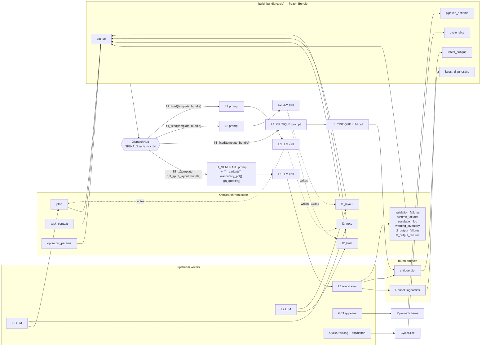

# Dispatch hub — placeholder index + flow

Visual reference for `promptpotter/application/optimization/dispatch_hub.py`. Pairs with [`l1-generate-surface.md`](l1-generate-surface.md) (L1 layout mechanics) and [`l2-internals.md`](l2-internals.md) (L2 firing + output).

The hub is stateless. Every `_r_*` renderer in `SIGNALS` is the construction recipe for one placeholder; the hub just looks the name up.

## Flow



## Placeholder index

14 signals + 3 caller extras. `[fenced]` signals wrap output in `<UNTRUSTED_DATASET_CONTENT>` for prompt-injection hardening (echo raw query text + GT + warnings).

```
DISPATCH v2 — 14 signals + 3 caller extras
│
├─ Strategic injects (written by another LLM layer)
│   ├─ {{plan}}            ← opt_sp.plan         (L3 writes; persistent, survives clear_volatile)
│   ├─ {{l2_directive}}    ← opt_sp.l2_brief     (L2 writes; sliding window 1; cleared on improvement)
│   └─ {{l3_to_l2_note}}   ← opt_sp.l3_note      (L2 template only — L1 explicitly excluded)
│
├─ Current state
│   ├─ {{rendered_prompt}} ← opt_sp.render() of the 8-field PromptTemplate
│   ├─ {{pipeline_axes}}   ← pipeline_schema.{node_param_keys, param_allowed_values,
│   │                                          param_descriptions, available_models}
│   ├─ {{task_context}}    ← opt_sp.task_context (skip raw_description / upstream_context /
│   │                                              downstream_context)
│   └─ {{current_params}}  ← opt_sp.optimizer_params      (L2/L3 only)
│
├─ Round-end measurement (computed once in execute_round, read by every layer)
│   ├─ {{diagnostics}}     ← latest_round.diagnostics (RoundDiagnostics from
│   │                                                  compute_round_diagnostics)        [fenced]
│   ├─ {{failures}}        ← opt_sp.{validation_failures, runtime_failures, escalation_log,
│   │                                 warning_inventory, l2_output_failures,
│   │                                 l3_output_failures}                                [fenced]
│   └─ {{critique}}        ← latest_round.critique (raw L1_CRITIQUE LLM output dict)
│
├─ L2/L3-internal context
│   ├─ {{l1_signal_catalogue}} ← sorted L1_POSSIBLE constant — menu L2 picks from for layouts
│   ├─ {{l1_rendered_prompt}}  ← L1 next-round preview (recursive fill_l1 over current
│   │                                                   opt_sp.l1_layout)
│   ├─ {{cycle_position}}      ← bundle.cycle_slice (round, accuracies, stall counts, probe flag)
│   └─ {{l2_history}}          ← cycle_slice.l2_round + opt_sp.optimizer_params +
│                                  Δ since L3 entry      (L3 template only)
│
└─ L1_GENERATE template scalars (NOT signals — caller extras at l1.py:123-127)
    ├─ {{n_variants}}     ← min(opt_sp.optimizer_params["n_variants"], opt.n_variants × 3)
    ├─ {{accuracy_pct}}   ← f"{cycle.tracking.current_accuracy:.1%}"
    └─ {{n_queries}}      ← len(cycle.tracking.current_results)
```

## Per-layer placement

| Layer | Template body has `{{...}}`? | How signals reach the LLM |
|---|---|---|
| L1_GENERATE  | No — slot bodies are plain text | `fill_l1` walks `opt_sp.l1_layout` (per-slot lists of signal names) and appends rendered signal text to each slot's static body. The 3 caller extras are then substituted by `compile_prompt`. |
| L1_CRITIQUE  | Yes (`{{plan}}`, `{{l2_directive}}`, `{{diagnostics}}`, `{{failures}}`) | `fill_fixed` regex-extracts `{{name}}`, returns `{name: rendered}`. |
| L2           | Yes | Same as L1_CRITIQUE. |
| L3           | Yes — plus `{{l2_history}}` available. | Same. |

L1 sees only `L1_POSSIBLE = {plan, l2_directive, rendered_prompt, pipeline_axes, diagnostics, failures, task_context, critique}`. The other six signals are L2/L3-internal.

L1 layout HARD-validates that `L1_MANDATORY = {plan, l2_directive, rendered_prompt, pipeline_axes}` appears somewhere across the four addressable slots (`persona`, `task_intent`, `problem_description`, `thinking_style` — `answer_format` is template-fixed).
