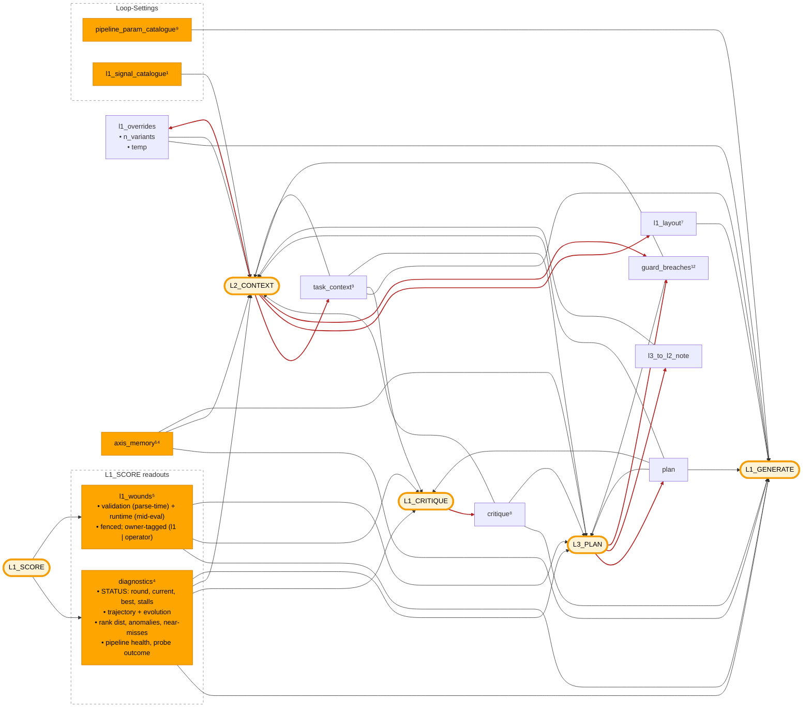

# Dispatch hub + L1 layout

Visual + reference for `promptpotter/application/optimization/dispatch/hub/` — the registry that fills `{{placeholders}}` in the four optimizer prompts — and for `L1Layout`, the structural surface L2 edits to decide what L1_GENERATE sees. Pairs with [`l2-internals.md`](l2-internals.md) (L2_CONTEXT firing).

The hub is stateless. `INJECTIONS` is a typed `dict[str, _Injection]` — each entry carries `name`, `kind` (MEASUREMENT / DERIVED / TRACE / DIRECTIVE), `render: InjectionBundle → str`, and a docstring, registered by the `@signal("<name>", …)` decorator at the renderer's definition site. `validate_template()` (called from `load_optimizer_prompt`) raises on `{{slot}}` names not in the registry: a typo in a template fails at module load, not at first render.

## Flow

Inputs (left) fill placeholders in optimizer process nodes (right).

- **Amber pill** — optimizer process node: the four LLM prompts (L1_GENERATE, L1_CRITIQUE, L2_CONTEXT, L3_PLAN) plus L1_SCORE (deterministic).
- **Solid orange** — deterministic input (schema, measurements, counters, constants).
- **Default node** — AI-generated input (content originates from another LLM stage).
- **Red arrow** — LLM-produced edge: the feedback loops that close the optimizer. L1_SCORE outputs (`diagnostics`, `l1_wounds`) are computed, so they draw in normal color. `guard_breaches` (post-parse validators on L2's / L3's own output) is LLM-produced, so its producer edges are red.



## Reference

**22 registered signals** across four modules (`injections/layer_state.py` · `panels.py` · `catalogues.py` · `wounds.py` — each slot's `@signal` docstring is the per-slot SoT), plus 1 structural input (`l1_layout`) and 1 caller extra (`n_variants`). The highest-traffic slots are detailed below, grouped by role; numbered items map to the diagram superscripts. `[fenced]` = output wrapped in `<UNTRUSTED_DATASET_CONTENT>` (echoes raw query + GT text — the STATUS prefix on `diagnostics` is plain, only the dataset-content body is fenced). 🧩 follows every sub-member name — companion to the inline expansion the diagram does for `l1_overrides` (`n_variants`🧩, `creativity`🧩); lets you scan for atomic field names regardless of which placeholder owns them.

Each entry in `INJECTIONS` is a frozen `_Injection(name, kind, render, doc)`. `kind` is one of:

- **MEASUREMENT** — deterministic round-end output (e.g. `diagnostics`, `l1_wounds`, `guard_breaches`).
- **DERIVED** — view/digest over MeasurementArchive or AxisIndex (e.g. `axis_memory`).
- **TRACE** — narrative state from prior LLM calls (e.g. `critique`, `plan`, `task_context`).
- **DIRECTIVE** — short-lived directive consumed by exactly one downstream layer (e.g. `l3_to_l2_note`).

### Round-end measurement — what L1_SCORE + L1_CRITIQUE leave behind

This is where the reader's mental model of a round usually starts: candidates were scored, results condensed, critique produced. These outputs are what the next round's prompts read.

- ⁴ **`diagnostics`** ← STATUS prefix (plain) + fenced `RoundDiagnostics` body
  - **STATUS prefix** ← `bundle.cycle_slice` — `round`🧩, `current`🧩 (parent fitness `f"{cs.current_accuracy:.1%}"`), `best`🧩 (acc + round), `L1 stall`🧩 (rounds), and — when fired — `L2 fired`🧩 (count + stall), `L3 fired`🧩 (count + stall). Plain text (cycle counters are trusted optimizer state, not untrusted dataset content). Always renders, including pre-round-1 when `digest.diagnostics is None`. Despite the `current`/`best` accuracy labels, the rendered values are mean composite *fitness* under the active scorer, not hit-rates.
  - **Body** [fenced] ← `bundle.digest.diagnostics`: `RoundDiagnostics` from `compute_round_diagnostics` (built deterministically by L1_SCORE) — trajectory + recent-rounds evolution, anomalies, rank dist + top-k, pipeline-health termination split, failures by step / warning class, near-misses, cross-candidate diff, diversity, cache-share, miss-sample, prompt-size warning, probe outcome 🧩
- ⁵ **`l1_wounds`** [fenced] ← `opt_sp.wounds.{validation_failures, runtime_failures}` · L1-owned wounds, one block
  - **Validation** (parse-time): `axis`🧩, `value`🧩 (LLM-proposed), `allowed`🧩, `reason`🧩 — from `L1_SCHEMA_COMPLIANCE`; synthetic-0 per-candidate, except `reason=hallucinated_node` which is non-fatal routed signal.
  - **Runtime** (mid-eval): per-candidate `DegradationCheck` evidence, owner-tagged (`owner=l1` retune · `owner=operator` flagged, not in-loop fixable); accumulates cross-round (NEW vs ACCUMULATED).
  - Fenced (echoes arbitrary LLM output + pipeline warnings). Renderer `_r_l1_wounds`.
- ¹² **`guard_breaches`** ← `opt_sp.wounds.{l2_guard_breaches, l3_guard_breaches}` · post-parse breaches, both owner=L3 (replan)
  - Plain (only `validator_id`🧩 from a controlled registry — no untrusted content). Renderer `_r_guard_breaches`.
  - Set by L2/L3 post-parse validators. A non-empty L2 block force-triggers an immediate L3 fire (read off the stream by `escalate_l2`, not this render); L3 also reads its own past breaches to avoid repeating them.
- ⁸ **`critique`** ← `bundle.digest.critique` (L1_CRITIQUE output, consumes ⁴ + ⁵)
  - Compact view via `format_l1_critique_for_prompt`
  - `summary`🧩, `priority_fix`🧩, `suggested_axes`🧩, `failure_highlights`🧩 (top 5)

### Strategic injects — L3_PLAN writes, L2_CONTEXT refines, persistent

- **`plan`** ← `opt_sp.plan` · L3_PLAN-only writer; never cleared.
- ³ **`task_context`** ← `opt_sp.task_context`
  - 5 rendered fields: `domain`🧩, `pipeline_purpose`🧩, `data_characteristics`🧩, `optimization_goals`🧩, `key_challenges`🧩
  - Seeded by `checkin` decomposition at `init`; L2_CONTEXT merges on each fire — broadcast to every layer as the persistent task framing
  - 3 model-only sub-fields skipped by the renderer: `raw_description`🧩, `upstream_context`🧩, `downstream_context`🧩
- **`l3_to_l2_note`** ← `opt_sp.wounds.l3_note` · L2_CONTEXT template only; explicitly excluded from L1_GENERATE.

### Cross-round derived

- ¹⁴ **`axis_memory`** (DERIVED) ← `cycle.axes.digest()` — AxisIndex per-axis effect_size + sample-coverage; consumed by L1_GENERATE, L2_CONTEXT, L3_PLAN. Empty when AxisIndex isn't yet initialised (round 1).
- **Panels family** (`injections/panels.py`, DERIVED views; each `@signal` docstring is the SoT): `escalation_panel` (L1 stall depth + `exploration_budget` — gates the `stall_exploration` citation), `evidence_health` (per-node failure rates — flags an evidence-starved enricher), `origin_strengths` (round-0 origin's per-sample hits, the floor variants must preserve), `intractable_samples` (cycle-wide miss set no candidate has solved), `archive_top_runs` (top-K historical runs on this dataset), `rare_hit_samples` (samples cracked by ≤3 of ≥10 attempts).
- **Capability + L2-authored directives** (`injections/layer_state.py`): `rebase_capability` / `terminate_capability` (conditional escape-hatch instructions into L2+L3 prompts; render empty when the config knob is off so ablation prompt bodies stay bit-identical), `l1_supplemental_rules` (situational rules appended to L1's instruction — auto-triggered from bundle state + L2-authored), `l1_situational_examples` (worked examples pinned to currently-active triggers).

### Current state

- **`rendered_prompt`** ← `opt_sp.render()`
  - 8-field `PromptTemplate` compiled to one string
  - Structurally L1_SCORE's output: each round's winner becomes next round's `opt_sp`, so its render is the next parent prompt. The cycle lives in orchestration, not the diagram.
- ⁹ **`pipeline_param_catalogue`** ← attributes on `pipeline_schema`: `node_param_keys`🧩, `param_allowed_values`🧩, `param_descriptions`🧩, `available_models`🧩
  - ≤4 enum values per param, ≤40-char description fallback, ≤8 models
- **`l1_overrides`** ← `opt_sp.l1_overrides`
  - Bundles two L2_CONTEXT-set knobs that govern *how L1_GENERATE runs*, not what L1_GENERATE puts in candidates: `n_variants`🧩, `creativity`🧩
  - `n_variants`🧩 enters L1_GENERATE only via the `{{n_variants}}` caller extra (a directive — L1_GENERATE obeys)
  - `creativity`🧩 sets the L1_GENERATE LLM call's temperature; never reaches the prompt text
  - Field, injection, and placeholder all share the name `l1_overrides`
- ⁷ **`l1_layout`** ← `opt_sp.l1_layout` · structural, not an INJECTION
  - L2_CONTEXT-only writer; consumed by `DispatchHub.fill` as `l1_generate`'s per-slot injection-name list that drives the slot walk (every node's layout comes from `NODE_LAYOUTS[node]`; `l1_generate`'s is L2-overridden via this field)
  - Decides *which* injection renderings land in each L1 addressable slot (`persona`🧩, `task_intent`🧩, `problem_description`🧩, `thinking_style`🧩) — content is rendered separately by the listed injections' `_r_*` functions
  - Not registered in `INJECTIONS`; never resolves a `{{l1_layout}}` placeholder. Shape-shifts L1's prompt rather than filling a slot in it

### L2_CONTEXT / L3_PLAN-internal

- ¹ **`l1_signal_catalogue`** ← sorted `L1_POSSIBLE` (`domain/l1_layout.py`) · menu L2_CONTEXT picks from when assembling L1_GENERATE's layout.

### Caller extras — L1_GENERATE template scalars (`l1/generate.py`)

Substituted directly by `compile_prompt`; not signals.

- **`n_variants`** ← `min(opt_sp.l1_overrides["n_variants"], opt.n_variants × 3)` · directive — L1_GENERATE obeys.

## Mechanics

- **Entry points** — two, both stateless: `render(name, bundle)` (internal, one injection's text) and `fill(template, layout, bundle)` (**every** optimizer node). `InjectionBundle` is the per-call frozen state `(opt_sp, pipeline_schema, cycle_slice, digest)`, built once via `build_bundle(cycle)`; `digest` is a `RoundDigest(diagnostics, critique)` — the post-scoring compression chain in one place, so renderers read through it instead of off two parallel `latest_*` fields.
- **Fill** — one path for every node: `fill(template, layout, bundle)` walks the node's layout (per-slot injection-name lists — `l1_generate`'s from `opt_sp.l1_layout`, the rest from `NODE_LAYOUTS[node].floor`), appends rendered injection text to each addressable slot, then scans the filled body for any `{{name}}` left in non-layout prose (`instruction`/`answer_format`, e.g. `rebase_capability`) and renders the `INJECTIONS` ones into a kwargs dict → `(filled_template, injection_vars)`. The four meta-prompt `problem_description` bodies are now empty strings (their `{{tokens}}` moved into `NODE_LAYOUTS`). `validate_template()` (called from `load_optimizer_prompt`) errors at module load if any remaining `{{slot}}` is not in the `INJECTIONS` registry.
- **L1_GENERATE visibility** — `L1_POSSIBLE` (`domain/l1_layout.py`, 13 names) = `{plan, task_context, rendered_prompt, pipeline_param_catalogue, diagnostics, l1_wounds, critique, axis_memory, escalation_panel, origin_strengths, intractable_samples, archive_top_runs, rare_hit_samples}` 🧩; the rest (`l3_to_l2_note`, `l1_overrides`, `l1_signal_catalogue`, `guard_breaches`, the capability directives) are L1_CRITIQUE / L2_CONTEXT / L3_PLAN-internal — L2-internal signals are excluded so L1 can't see L2's own state.
- **L1_GENERATE guard** — `L1_MANDATORY = {plan, task_context, rendered_prompt, pipeline_param_catalogue, critique}` 🧩 must appear across the 4 addressable slots; missing fires `l1_layout_missing_mandatory` — a guard breach that routes to L3_PLAN (replan) rather than letting L2_CONTEXT starve L1_GENERATE of cross-layer state (without these L1 has no parent prompt, plan, task framing, mutation surface, or failure digest).

## L1 layout — L2's structural edit surface

L1_GENERATE's prompt is composed by walking a per-slot list of **injection names** and resolving each through the registry above. L2 owns the layout; the registry is closed and code-derived. Concept role: [`the-loop.md`](../concepts/the-loop.md).

```
┌─ L1's prompt composition ──────────────────────────────────┐
│  PromptTemplate (l1_generate)        per-slot static text  │
│      +                                                     │
│  L1Layout (on OptSearchPoint)    per-slot injection lists  │
│      ↓                                                     │
│  DispatchHub.fill                    resolves names via    │
│                                      INJECTIONS registry   │
│      ↓                                                     │
│  RENDERED L1 PROMPT (what the LLM sees)                    │
└────────────────────────────────────────────────────────────┘
```

`L1Layout` (`promptpotter/domain/l1_layout.py`) is a Pydantic model with one list per addressable slot: `persona`, `task_intent`, `problem_description`, `thinking_style` (all L2-mutable). `answer_format` is omitted on purpose — it carries L1's output JSON schema (a code contract), not L2's call. Static text in each slot stays; the layout's injection renderings are appended. Renderers are layer-agnostic — the same `plan` renderer feeds L1, L2, and L3; if an injection needs to differ per layer, that's two injections.

**Default floor** (`default_l1_layout` = `NODE_LAYOUTS["l1_generate"].floor`): `task_context` in `task_intent`; `rendered_prompt`, `pipeline_param_catalogue`, `plan`, `critique`, `l1_wounds`, `escalation_panel`, `origin_strengths` in `problem_description`. Raw `diagnostics` and the cross-run panels stay off the floor (critique distils them); L2 adds them on stall via its layout edit, and L4 optimises that authoring. Most L2 fires don't touch the layout.

**Validation — split HARD / SOFT.** `validate_l1_layout(layout, *, spec, prior_layout)` enforces against the node's `NodeLayoutSpec` (`spec.mandatory`/`spec.possible`):

- HARD — missing mandatory placeholder, name outside the node's `possible`, duplicate within a slot. Caller rolls back to the prior layout / floor; outcomes append to the guard-breach wound stream for self-healing on the next L2 fire.
- SOFT — layout unchanged from prior. Applied with a warning; flagged `score=0.5` so L3 sees the churn signal next replan.

L2's parser (`escalation._parse_l2`) coerces `{slot: [name, ...]}` into `L1Layout`, validates, and only writes the new layout to OSP when HARD checks pass.

**Adding an injection** → the golden-path recipe lives in [`adding-a-surface.md`](adding-a-surface.md).

**File-line anchors** — `INJECTIONS`: `dispatch/hub/injections/registry.py` · `InjectionBundle`: `dispatch/hub/bundle.py` · `DispatchHub` + `build_bundle`: `dispatch/hub/facade.py` · `L1Layout`, `L1_POSSIBLE`, `L1_MANDATORY`, `L1_LAYOUT_SLOTS`, `default_l1_layout`, `validate_l1_layout`: `promptpotter/domain/l1_layout.py` · L1 compose path: `application/optimization/l1/generate.py::l1_generate` · OSP layout field: `OptSearchPoint.memory.l1_layout` (`domain/opt_search_point.py`, `L2L3Memory`).

## Future — diagnostics vs l1_wounds

The wound-render merge is **done**: validation + runtime render as one `l1_wounds` block, and the two guard streams as `guard_breaches`. What stays distinct is `diagnostics` vs `l1_wounds` — `diagnostics` is per-round on `Bundle.digest` while the wound streams accumulate on `OptSearchPoint` cross-round, so a shared `MeasurementReadout` would either duplicate state into `RoundDigest` or move accumulating fields off OSP (breaking per-candidate attribution). Storage stays the three typed `WoundChannels` lists **deliberately** (`self-healing-internals.md`) — only rendering collapsed. Park the diagnostics↔wounds merge until the readout shapes stabilise.
