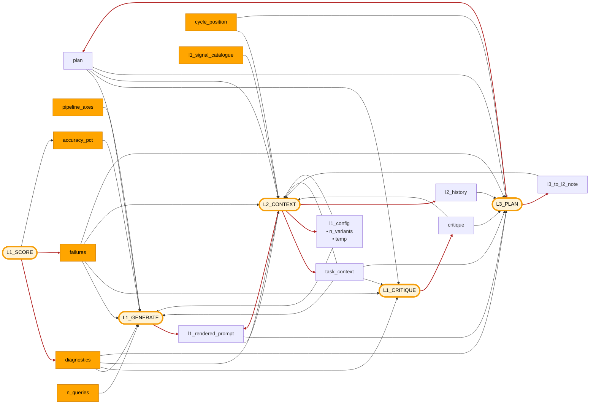

# Dispatch hub — placeholder index + flow

Visual reference for `promptpotter/application/optimization/dispatch_hub.py`. Pairs with [`l1-generate-surface.md`](l1-generate-surface.md) (L1 layout mechanics) and [`l2-internals.md`](l2-internals.md) (L2 firing + output).

The hub is stateless. Every `_r_*` renderer in `SIGNALS` is the construction recipe for one placeholder; the hub just looks the name up.

## Flow

Inputs on the left fill `{{placeholders}}` in the optimizer process nodes on the right.

- **Amber-rimmed pill node** = optimizer process node — the four LLM prompts (L1_GENERATE, L1_CRITIQUE, L2_CONTEXT, L3_PLAN) plus L1_SCORE (the deterministic scoring/winner-selection node). Same accent color as the webapp's `--color-accent`.
- **Solid orange node** = deterministic input (schema, round measurements, cycle counters, code constants — no LLM in the chain).
- **Default node** = AI-generated input.
- **Red arrow** (firebrick) = the process node that *produces* this input — the feedback edges that close the optimizer's loops. Includes L1_SCORE → `diagnostics` / `failures` (computed from measurements). The L1_GENERATE ↔ L1_SCORE candidate-flow and winner-selection happen between rounds and aren't drawn — the diagram is about placeholder fill, not orchestration.



> Why "AI-generated" for `l1_rendered_prompt` / `task_context` / `l1_config` / `l2_history`: their *content* originates from an LLM (L1's prompt evolution, L2/L3 mutations of `l1_config`, L2's `task_context` merges). Their *format* is deterministic, but the strings injected are not. `task_context`'s initial value is seeded by a one-time `restructure` decomposition LLM at `init` time; L2 then refines it each fire — broadcast to every prompt as the persistent task framing.
>
> `l1_config` bundles two L2-set knobs that govern *how L1 runs*, not what L1 puts in candidates: `n_variants` enters L1's prompt as the `{{n_variants}}` caller extra (a directive — L1 obeys); `creativity` sets the L1 LLM call's temperature (configures the API call, never the prompt text). Field, signal, and placeholder all share the name `l1_config`.
>
> The `rendered_prompt` SIGNAL still exists in code (it's in `SIGNALS` and L1's default layout) — it's literally `opt_sp.render()`, the 8-field `PromptTemplate` compiled into one string. Structurally it's L1_SCORE's output: each round's winner becomes the new `opt_sp`, and next round's L1_GENERATE reads `opt_sp.render()` as its parent prompt. The cycle isn't drawn explicitly — it lives in orchestration (between-round state update), not in placeholder dispatch.

## Placeholder index

13 signals + 3 caller extras. `[fenced]` signals wrap output in `<UNTRUSTED_DATASET_CONTENT>` for prompt-injection hardening (echo raw query text + GT + warnings).

```
DISPATCH v2 — 13 signals + 3 caller extras
│
├─ Strategic injects (written by another LLM layer)
│   ├─ {{plan}}            ← opt_sp.plan         (L3 writes; persistent, never cleared)
│   ├─ {{task_context}}    ← opt_sp.task_context (seeded by restructure decomposition at init;
│   │                                              L2 refines via merge — broadcast to every layer)
│   └─ {{l3_to_l2_note}}   ← opt_sp.l3_note      (L2 template only — L1 explicitly excluded)
│
├─ Current state
│   ├─ {{rendered_prompt}} ← opt_sp.render() of the 8-field PromptTemplate
│   ├─ {{pipeline_axes}}   ← pipeline_schema.{node_param_keys, param_allowed_values,
│   │                                          param_descriptions, available_models}
│   └─ {{l1_config}}       ← opt_sp.l1_config             (L2 reads as state;
│                                                          L1 reads contents via caller extras)
│
├─ Round-end measurement (computed once in execute_round, read by every layer)
│   ├─ {{diagnostics}}     ← latest_round.diagnostics (RoundDiagnostics from
│   │                                                  compute_round_diagnostics)        [fenced]
│   ├─ {{failures}}        ← opt_sp.{validation_failures, runtime_failures, escalation_log,
│   │                                 warning_inventory, l2_output_failures,
│   │                                 l3_output_failures}                                [fenced]
│   └─ {{critique}}        ← latest_round.critique (raw L1_CRITIQUE LLM output dict)
│
├─ L2/L3-internal context
│   ├─ {{l1_signal_catalogue}} ← sorted L1_POSSIBLE constant — menu L2 picks from for layouts
│   ├─ {{l1_rendered_prompt}}  ← L1 next-round preview (recursive fill_l1 over current
│   │                                                   opt_sp.l1_layout)
│   ├─ {{cycle_position}}      ← bundle.cycle_slice (round, accuracies, stall counts, probe flag)
│   └─ {{l2_history}}          ← cycle_slice.l2_round + opt_sp.l1_config +
│                                  Δ since L3 entry      (L3 template only)
│
└─ L1_GENERATE template scalars (NOT signals — caller extras at l1.py:123-127)
    ├─ {{n_variants}}     ← min(opt_sp.l1_config["n_variants"], opt.n_variants × 3)
    ├─ {{accuracy_pct}}   ← f"{cycle.tracking.current_accuracy:.1%}"
    └─ {{n_queries}}      ← len(cycle.tracking.current_results)
```

## Per-layer placement

| Layer | Template body has `{{...}}`? | How signals reach the LLM |
|---|---|---|
| L1_GENERATE  | No — slot bodies are plain text | `fill_l1` walks `opt_sp.l1_layout` (per-slot lists of signal names) and appends rendered signal text to each slot's static body. The 3 caller extras are then substituted by `compile_prompt`. |
| L1_CRITIQUE  | Yes (`{{plan}}`, `{{task_context}}`, `{{diagnostics}}`, `{{failures}}`) | `fill_fixed` regex-extracts `{{name}}`, returns `{name: rendered}`. |
| L2           | Yes | Same as L1_CRITIQUE. |
| L3           | Yes — plus `{{l2_history}}` available. | Same. |

L1 sees only `L1_POSSIBLE = {plan, task_context, rendered_prompt, pipeline_axes, diagnostics, failures, critique}`. The other six signals are L2/L3-internal.

L1 layout HARD-validates that `L1_MANDATORY = {plan, task_context, rendered_prompt, pipeline_axes}` appears somewhere across the four addressable slots (`persona`, `task_intent`, `problem_description`, `thinking_style` — `answer_format` is template-fixed).
