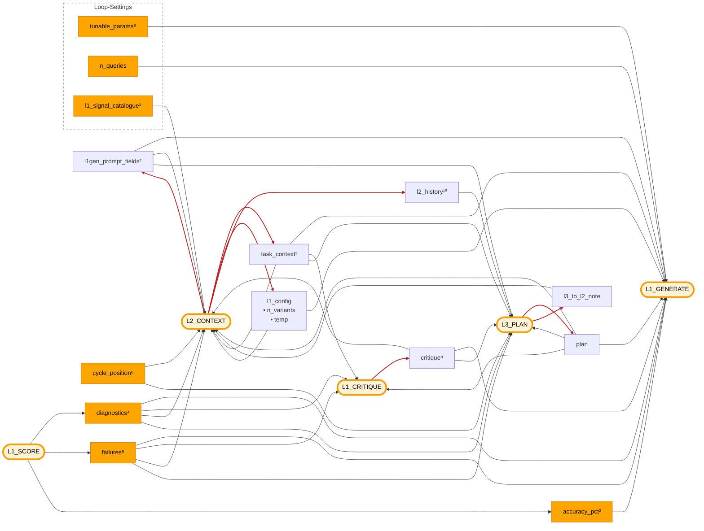

# Dispatch hub

Visual + reference for `promptpotter/application/optimization/dispatch_hub.py` — the registry that fills `{{placeholders}}` in the four optimizer prompts. Pairs with [`l1-generate-surface.md`](l1-generate-surface.md) (L1 layout) and [`l2-internals.md`](l2-internals.md) (L2 firing).

The hub is stateless. Each `_r_*` renderer in `SIGNALS` is the construction recipe for one placeholder; the hub looks the name up, renders, returns a dict.

## Flow

Inputs (left) fill placeholders in optimizer process nodes (right).

- **Amber pill** — optimizer process node: the four LLM prompts (L1_GENERATE, L1_CRITIQUE, L2_CONTEXT, L3_PLAN) plus L1_SCORE (deterministic).
- **Solid orange** — deterministic input (schema, measurements, counters, constants).
- **Default node** — AI-generated input (content originates from another LLM stage).
- **Red arrow** — LLM-produced edge: the feedback loops that close the optimizer. L1_SCORE outputs (`diagnostics`, `failures`, `accuracy_pct`) are computed, so they draw in normal color.

## Reference

13 signals + 3 caller extras, grouped by role. Numbered items map to the diagram superscripts. `[fenced]` = output wrapped in `<UNTRUSTED_DATASET_CONTENT>` (echoes raw query + GT text).

### Strategic injects — L3 writes, L2 refines, persistent

- **`plan`** ← `opt_sp.plan` · L3-only writer; never cleared.
- ³ **`task_context`** ← `opt_sp.task_context`
  - 5 fields rendered: `domain`, `pipeline_purpose`, `data_characteristics`, `optimization_goals`, `key_challenges`
  - Seeded by `restructure` decomposition at `init`; L2 merges on each fire — broadcast to every layer as the persistent task framing
  - 3 sub-fields exist on the model (`raw_description`, `upstream_context`, `downstream_context`) but the renderer skips them
- **`l3_to_l2_note`** ← `opt_sp.l3_note` · L2 template only; explicitly excluded from L1.

### Current state

- **`rendered_prompt`** ← `opt_sp.render()`
  - 8-field `PromptTemplate` compiled to one string
  - Structurally L1_SCORE's output: each round's winner becomes next round's `opt_sp`, so its render is the next parent prompt. The cycle lives in orchestration, not the diagram.
- ⁹ **`tunable_params`** ← `pipeline_schema.{node_param_keys, param_allowed_values, param_descriptions, available_models}`
  - ≤4 enum values per param, ≤40-char description fallback, ≤8 models
- **`l1_config`** ← `opt_sp.l1_config`
  - Bundles two L2-set knobs that govern *how L1 runs*, not what L1 puts in candidates
  - `n_variants` enters L1 only via the `{{n_variants}}` caller extra (a directive — L1 obeys)
  - `creativity` sets the L1 LLM call's temperature; never reaches the prompt text
  - Field, signal, and placeholder all share the name `l1_config`

### Round-end measurement

- ⁴ **`diagnostics`** [fenced] ← `bundle.digest.diagnostics`
  - `RoundDiagnostics` from `compute_round_diagnostics`
  - Trajectory + recent-rounds evolution, anomalies, rank dist + top-k, pipeline-health termination split, failures by step / warning class, near-misses, cross-candidate diff, diversity, cache-share, miss-sample, prompt-size warning, probe outcome
- ⁸ **`critique`** ← `bundle.digest.critique`
  - Compact L1_CRITIQUE output via `format_l1_critique_for_prompt`: `summary`, `priority_fix`, `suggested_axes`, `failure_highlights` (top 5)
- ⁵ **`failures`** [fenced] ← `opt_sp.{validation_failures, runtime_failures, escalation_log, warning_inventory, l2_output_failures, l3_output_failures}`
  - Accumulates across rounds — that's why it lives on `OptSearchPoint`, not in the per-round `Bundle.digest`

### L2/L3-internal

- ¹ **`l1_signal_catalogue`** ← sorted `L1_POSSIBLE` (`domain/l1_layout.py`) · menu L2 picks from when assembling L1's layout.
- ⁷ **`l1gen_prompt_fields`** ← recursive `fill_l1` over current `opt_sp.l1_layout` against L1_GENERATE's 8-field template
  - Snapshot of what L1 will receive next round
  - L2 is the sole writer (via the layout) — hence no `L1G → l1gen_prompt_fields` arrow in the diagram
  - 4 addressable slots: `persona`, `task_intent`, `problem_description`, `thinking_style`
  - `instruction` + `answer_format` are template-fixed
- ⁶ **`cycle_position`** ← `bundle.cycle_slice` · round, best (acc + round), current acc, L1/L2/L3 stalls, probe-scheduled flag.
- ¹⁰ **`l2_history`** ← `cycle_slice.l2_round` + prior `opt_sp.l1_config` snapshot + Δ best-fitness since L3 entry · L3-only synthetic recap.

### Caller extras — L1_GENERATE template scalars (`l1.py:120-124`)

Substituted directly by `compile_prompt`; not signals.

- **`n_variants`** ← `min(opt_sp.l1_config["n_variants"], opt.n_variants × 3)` · directive — L1 obeys.
- ² **`accuracy_pct`** ← `f"{cycle.tracking.current_accuracy:.1%}"`
  - Despite the name, this is the parent searchpoint's mean composite *fitness* under the active scorer, not a hit-rate
  - `current_accuracy` is the historical tracker attribute on the cycle
- **`n_queries`** ← `len(cycle.tracking.current_results)` · scoring-set size.

## Mechanics

- **Fill** — L1_GENERATE slot bodies are plain text; `fill_l1` walks `opt_sp.l1_layout` (per-slot signal-name lists) and appends rendered signal text to each slot. L1_CRITIQUE / L2 / L3 bodies carry literal `{{name}}` markers; `fill_fixed` regex-extracts and resolves them.
- **L1 visibility** — `L1_POSSIBLE = {plan, task_context, rendered_prompt, tunable_params, diagnostics, failures, critique}`; the other 6 signals are L2/L3-internal.
- **L1 guard** — `L1_MANDATORY = {plan, task_context, rendered_prompt, tunable_params, critique}` must appear across the 4 addressable slots; missing fires `l1_layout_missing_mandatory` with `nurse_target='l3'` (L3 replans rather than letting L2 starve L1 of cross-layer state).
