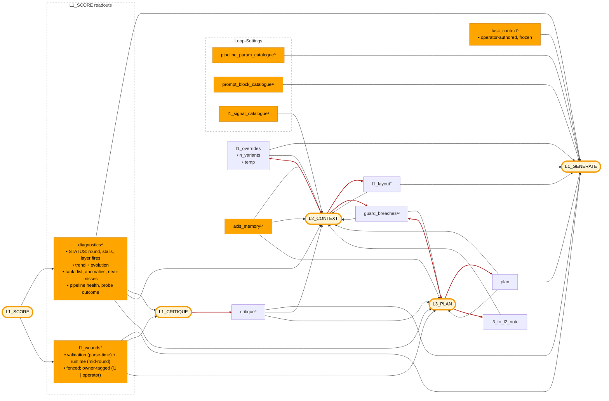

# Dispatch hub + L1 layout + L2 internals

Visual + reference for `promptpotter/application/optimizers/potter/dispatch/` — the registry that fills `{{placeholders}}` in the four optimizer prompts — and for `L1Layout`, the structural surface L2 edits to decide what L1_GENERATE sees. **L2_CONTEXT firing lives here too**, from § Trigger down: L2 is one entry in this hub — same `LayerStrategy` shape as L3, same `fill` path (from its `NODE_LAYOUTS["l2_context"].floor`), same `Bundle` per-call state, and the hub is what stops it accumulating its own renderers, surface object and escape hatches. Concept role: [`../concepts/the-loop.md`](../concepts/the-loop.md).

The hub is stateless. `injection_table()` is a `Mapping[str, _Injection]` built and checked on its first call — each entry carries `name`, `kind` (MEASUREMENT / DERIVED / TRACE / DIRECTIVE), `render: InjectionBundle → list[Item]`, a `char_cap` and a `citable` flag, registered by the `@signal("<name>", …)` decorator at the renderer's definition site. `validate_template()` (called from `load_optimizer_prompt`) raises on `{{slot}}` names not in the registry: a typo in a template fails at template load, not at first render.

`citable` answers one question: may an `l1_generate` variant name this panel in `evidence_grounding`? True for panels that REPORT (what was measured, what failed, what the layers steered); False for the value-space menus and the prompt under edit — citing those grounds a mutation in its own subject. `citable_fields(layout, exploration_budget, rendered)` intersects the flag with the node's **live layout** and what rendered, so what L1 may cite is exactly what L1 was shown; that call fills the wire schema's enum — the one place the menu is stated — and the round banks it as `PotterRoundState.l1_citable`, which is what the `evidence_grounding_present` check reads. Adding a panel to a floor makes it citable automatically.

## Flow

Inputs (left) fill placeholders in optimizer process nodes (right).

- **Amber pill** — optimizer process node: the four LLM prompts (L1_GENERATE, L1_CRITIQUE, L2_CONTEXT, L3_PLAN) plus L1_SCORE (deterministic).
- **Solid orange** — deterministic input (schema, measurements, counters, constants).
- **Default node** — AI-generated input (content originates from another LLM stage).
- **Red arrow** — LLM-produced edge: the feedback loops that close the optimizer. L1_SCORE outputs (`diagnostics`, `l1_wounds`) are computed, so they draw in normal color. `guard_breaches` (post-parse validators on L2's / L3's own output) is LLM-produced, so its producer edges are red.


```mermaid
flowchart LR
  classDef det fill:#FFA500,stroke:#cc7a00,color:#000
  classDef proc fill:#fff3d6,stroke:#f59e0b,stroke-width:4px,color:#000

  %% Standalone AI-generated inputs (not produced inside a single LLM stage)
  CPAR["l1_overrides<br/>• n_variants<br/>• temp"]

  %% L1_SCORE readouts — diagnostics is per-round on Bundle.digest; l1_wounds
  %% (validation parse-time + runtime mid-round) accumulates on PotterState.memory.wounds cross-round.
  subgraph SR["L1_SCORE readouts"]
    DIAG["diagnostics⁴<br/>• STATUS: round, stalls, layer fires<br/>• trend + evolution<br/>• rank dist, anomalies, near-misses<br/>• pipeline health, probe outcome"]:::det
    L1W["l1_wounds⁵<br/>• validation (parse-time) + runtime (mid-round)<br/>• fenced; owner-tagged (l1 | operator)"]:::det
  end
  style SR fill:none,stroke:#888,stroke-dasharray: 5 5

  %% Post-parse guard breaches — produced by L2P / L3P; both owner=L3 (replan).
  GB[guard_breaches¹²]

  %% Loop-Settings — read-only loop-time constants
  subgraph LS["Loop-Settings"]
    TUN[pipeline_param_catalogue⁹]:::det
    BLK[prompt_block_catalogue¹³]:::det
    CAT[l1_signal_catalogue¹]:::det
  end
  style LS fill:none,stroke:#888,stroke-dasharray: 5 5

  %% L1_GENERATE + L1_SCORE + L2_CONTEXT — standalone process nodes
  L1G([L1_GENERATE]):::proc
  L1S([L1_SCORE]):::proc
  L2P([L2_CONTEXT]):::proc

  %% Operator-authored framing — decomposed at check-in, frozen for the run; no layer writes it
  TC["task_context³<br/>• operator-authored, frozen"]:::det

  %% Standalone L2-produced signal
  LAYOUT[l1_layout⁷]

  %% Cross-round AxisIndex digest
  AXM[axis_memory¹⁴]:::det

  %% L1_CRITIQUE + its produced injection
  subgraph L1CG[" "]
    L1C([L1_CRITIQUE]):::proc
    CRIT[critique⁸]
  end
  style L1CG fill:none,stroke:none

  %% L3_PLAN + its outputs
  subgraph L3G[" "]
    L3P([L3_PLAN]):::proc
    PLAN[plan]
    L3N[l3_to_l2_note]
  end
  style L3G fill:none,stroke:none

  %% L1_GENERATE inputs — sees its own wounds (l1_wounds). LAYOUT is structural AND read back by
  %% its own writer: an edit is per slot, so L2 must see what it is about to overwrite.
  PLAN --> L1G
  TC --> L1G
  TUN --> L1G
  BLK --> L1G
  DIAG --> L1G
  L1W --> L1G
  CRIT --> L1G
  CPAR --> L1G
  LAYOUT --> L1G
  AXM --> L1G

  %% L1_CRITIQUE inputs (the distiller reads raw round output, not the strategic frame —
  %% plan/task_context are not in its layout vocabulary)
  DIAG --> L1C
  L1W --> L1C

  %% L2_CONTEXT inputs — its framing wounds are guard_breaches; L1's own wounds
  %% are L1's to heal now (the old L2-briefs-L1 path is cut).
  PLAN --> L2P
  L3N --> L2P
  DIAG --> L2P
  GB --> L2P
  CRIT --> L2P
  CPAR --> L2P
  CAT --> L2P
  AXM --> L2P
  LAYOUT --> L2P

  %% L3_PLAN inputs — sink: sees both wound groups.
  PLAN --> L3P
  DIAG --> L3P
  L1W --> L3P
  GB --> L3P
  CRIT --> L3P
  AXM --> L3P

  %% LLM-produced feedback edges (red)
  L3P --> PLAN
  L3P --> L3N
  L2P --> CPAR
  L2P --> LAYOUT
  L1C --> CRIT
  L2P --> GB
  L3P --> GB

  %% L1_SCORE derivations — deterministic; normal color
  L1S --> DIAG
  L1S --> L1W

  %% Red styling for the 7 LLM-produced feedback edges (post-round)
  linkStyle 27,28,29,30,31,32,33 stroke:#B22222,stroke-width:2px
```

## Reference

**The registered signals** are every `@signal(…)` across four modules (`injections/layer_state.py` · `panels.py` · `catalogues.py` · `wounds.py` — each renderer is its slot's SoT), plus 2 caller extras (`n_variants`, `citable_fields`). The highest-traffic slots are detailed below, grouped by role; numbered items map to the diagram superscripts. `[fenced]` = output wrapped in `<UNTRUSTED_DATASET_CONTENT>` (echoes raw query + GT text — the STATUS prefix on `diagnostics` is plain, only the dataset-content body is fenced). 🧩 follows every sub-member name — companion to the inline expansion the diagram does for `l1_overrides` (`n_variants`🧩, `creativity`🧩); lets you scan for atomic field names regardless of which placeholder owns them.

### Every item that reaches an LLM carries an upper limit — bounded where it is PRODUCED

**No injectable is unbounded, and a `char_cap` alone does not bound one.** The limit has to exist where the text is *authored*, because that is the only place an overlong item can be judged **faulty** rather than quietly shortened — truncating at render turns a producer's fault into silent content loss with nobody at fault and every gate green. Bound it where it is written, cap it where it is rendered, let the composition spend what is left.

| where it is produced | the bound that judges it |
|---|---|
| an LLM optimizer output (`plan`, `critique`, an L2/L3 field) | `max_length` + a `_truncate*` validator on the response model (`dispatch/schemas.py`) — the parse boundary |
| operator-authored framing (`task_context`) | `TaskDecomposition.check_budget` at mint — per field **and** in total, so five legal fields cannot compose an illegal framing |
| a derived/measurement view | its own `*_RENDER_CAP` top-K, which bounds rows rather than characters |

`char_cap` catches only what those missed, and only on the indivisible panels (`@signal(char_cap=…)` where `kind.divisible` is false). No other panel carries one: a production cap pre-decides how much a panel takes against a ceiling the panel cannot see, and a set of such caps chosen one at a time has a sum nobody owns.

**The composition owns the budget, the fence and the count — because a panel can see none of them.** Renderers hand back `list[Item]` of `(text, trusted)`; `compose.select` takes each panel's next item in layout order, round after round, until `OPTIMIZER_DISCRETIONARY_CHARS` is spent by the DISCRETIONARY panels alone. Why those three are the composition's is `dispatch/compose.py`'s header; what a renderer must do about them:

- **`L1_MANDATORY` is admitted whatever it costs**, served first and charged separately — a first claim on a budget is not the same promise as being present. A mandatory panel the composition cannot place raises `MandatoryPanelStarvedError`.
- **Selection drops whole items and never slices one**, and every panel places its first item before any panel places its second, so no panel can crowd the package by being large.
- **A renderer never bakes its own fence** and writes no `(+N not shown)` line: it cannot know where the selection will cut, and an unterminated fence lets sample text run loose to the end of the prompt — a prompt-injection surface.
- **Row granularity is what stops starvation.** A panel handing back one large fenced block cannot be thinned, only starved whole.

Which panels may be thinned is `InjectionKind.divisible`, asked of the kind every signal already declares: MEASUREMENT and DERIVED are evidence and thin gracefully, TRACE and DIRECTIVE carry state and are placed whole or not at all. Asked of the kind rather than a set of names, because a set silently skips whatever it failed to list. `mutation_memory` renders **newest round first**, so what the ceiling drops is the OLDEST attempt. `prompt_chars` stays the measurement, and what selection dropped rides beside it.

Each entry in `injection_table()` is a frozen `_Injection(name, kind, render, char_cap, citable)` — `char_cap` set only on the indivisible panels. `kind` is one of:

- **MEASUREMENT** — deterministic round-end output (e.g. `l1_wounds`, `guard_breaches`).
- **DERIVED** — view/digest over the round's diagnostics, MeasurementArchive or AxisIndex (e.g. `diagnostics`, `axis_memory`).
- **TRACE** — narrative state from prior LLM calls (e.g. `critique`, `plan`, `task_context`).
- **DIRECTIVE** — short-lived directive consumed by exactly one downstream layer (e.g. `l3_to_l2_note`).

### Round-end measurement — what L1_SCORE + L1_CRITIQUE leave behind

This is where the reader's mental model of a round usually starts: candidates were scored, results condensed, critique produced. These outputs are what the next round's prompts read.

- ⁴ **`diagnostics`** ← STATUS prefix (plain) + fenced `RoundDiagnostics` body
  - **STATUS prefix** ← `bundle.cycle_slice` — `round`🧩, `L1 stall`🧩 (rounds), and — when fired — `L2 fired`🧩 (count + stall), `L3 fired`🧩 (count + stall). Plain text (cycle counters are trusted optimizer state, not untrusted dataset content). Always renders, including pre-round-1 when `digest.diagnostics is None`. **No `current`/`best` fitness column here** — `CycleSlice` drops it deliberately: cycle tracking's pair is subset-relative and lags the round being rendered, so a panel carrying it holds a second, staler copy of the EVOLUTION series (`RoundDiagnostics.evolution_rows`, which carries `elected`).
  - **Body** [fenced] ← `bundle.digest.diagnostics`: `RoundDiagnostics` from `compute_round_diagnostics` (built deterministically by L1_SCORE) — trend + recent-rounds evolution, anomalies, rank dist + top-k, pipeline-health termination split, failures by step / warning class, near-misses, cross-candidate diff, L1 yield, cache-share, miss-sample, prompt-size warning, probe outcome 🧩
- ⁵ **`l1_wounds`** [fenced] ← `PotterState.memory.wounds.{validation_failures, runtime_failures}` · L1-owned wounds, one block
  - **Validation** (parse-time): `axis`🧩, `value`🧩 (LLM-proposed), `allowed`🧩, `reason`🧩 — from the reject gates in `validators/l1_strict.py`; synthetic-0 per-candidate, except `reason=hallucinated_node` which is non-fatal routed signal.
  - **Runtime** (mid-round): per-candidate `DegradationCheck` evidence, owner-tagged (`owner=l1` retune · `owner=operator` flagged, not in-loop fixable); accumulates cross-round (NEW vs ACCUMULATED).
  - Fenced (echoes arbitrary LLM output + pipeline warnings). Renderer `_r_l1_wounds`.
- ¹² **`guard_breaches`** ← `PotterState.memory.wounds.{l2_guard_breaches, l3_guard_breaches}` · post-parse breaches, both owner=L3 (replan)
  - Plain: `validator_id`🧩 plus its `evidence`, whose values render only where they name a signal, a slot or a target prompt field — all closed vocabularies. An LLM-authored placeholder or plan reports its size, so no untrusted content reaches the unfenced block. Renderer `_r_guard_breaches`.
  - Set by L2/L3 post-parse validators. A REFUSED L2 layout edit force-triggers an immediate L3 fire (§ Wound 4 — off `TransitionResult`, never off this stream, two of whose members are inert); L3 also reads its own past breaches to avoid repeating them.
- ⁸ **`critique`** ← `bundle.digest.critique` (L1_CRITIQUE output, consumes ⁴ + ⁵)
  - Compact view via `format_l1_critique_for_prompt`
  - `summary`🧩, `priority_fix`🧩, `suggested_axes`🧩, `failure_highlights`🧩 (top 5)

### Strategic injects — L3_PLAN writes the plan, the operator authors the framing, persistent

- **`plan`** ← `PotterState.memory.plan` · L3_PLAN-only writer; never cleared.
- ³ **`task_context`** ← `Cycle.framing` (the campaign's)
  - 5 framing fields: `domain`🧩, `pipeline_purpose`🧩, `data_characteristics`🧩, `optimization_goals`🧩, `key_challenges`🧩 — plus the two splice fields below, so 7 render here; all seven are frozen
  - Authored at check-in (`CheckinOutput.task_context`, edited by the operator before mint) and **FROZEN there** — on `l1_generate`'s floor only (`NODE_LAYOUTS`); `l2_context` / `l3_plan` hold it in `possible`, an axis L4 can search back in. No L1/L2/L3 wire schema has a field of it, so no fire can move a byte of it. That is what puts `task_context` in `dispatch/layout.py::PREFIX_STABLE_PANELS` — the one panel a floor may place ahead of `VOLATILE_SLOT` without voiding the provider's prefix cache, measured surviving all of `task_intent` on a live round pair.
  - `raw_description`🧩 renders nowhere. `upstream_context`🧩 / `downstream_context`🧩 render HERE and also splice around `problem_description` into the TARGET prompt (`OptSearchPoint.target_fields`) — even an empty one. This panel is the only place L1 sees them as context: `rendered_prompt` reads `render_fields()`, so the field it offers for replacement does not carry them
- **`l3_to_l2_note`** ← `PotterState.memory.wounds.l3_note` · L2_CONTEXT template only; explicitly excluded from L1_GENERATE.

### Cross-round derived

- ¹⁴ **`axis_memory`** (DERIVED) ← `PotterState.axes(cycle).digest()` — AxisIndex per-axis effect_size + sample-coverage; consumed by L1_GENERATE, L2_CONTEXT, L3_PLAN. Empty when AxisIndex isn't yet initialised (round 1).
- **Panels family** (`injections/panels.py`, MEASUREMENT or DERIVED per each one's own `@signal`). **Each `_r_*` docstring is its panel's SoT** — what it reports, when it stays silent and why; this roster says only what each is FOR: `escalation_panel` (L1 stall depth + `exploration_budget` — gates the `stall_exploration` citation), `evidence_health` (per-node failure rates — flags an evidence-starved enricher), `answer_distribution` (the collapse detector. It renders the rule but does not own it: `domain/scoring.py::enumerable_truth_labels` is the one definition of "is there a constant to detect here", shared with the scoring gate that withholds θ from a collapsed candidate and with PoBB, which eliminates it), `failing_samples` (every current miss, easiest-first on the cycle's locked δ ruler — or, with no label, the verifier's `outcome_note` and the turns and tokens the cell spent), `mutation_memory` (what this cycle has ALREADY tried: each edit as the words it wrote and cut against the parent it was mutated from — the round BEFORE its own — what it scored against that matched parent — accuracy, plus the composite where θ is fit on a `per_cell` formula — how it ended, and the cells it GAINED and LOST there (`RoundResult.cell_delta`), with the cells edits keep missing summed beneath. On the critique's floor as well as the generator's, and `sample_transcripts` leads with those cells' missing runs for the same reason), `origin_strengths` (what the round-0 origin already scores, the floor variants must preserve), `archive_top_runs` (top-K historical runs on this dataset), `rare_hit_samples` (samples cracked by ≤3 of ≥10 attempts). Beside them the **decision frame** — short, self-suppressing, and the half a reader needs before any of the above means anything: `measurand` (what ELECTS, then what is reported beside it and decides nothing), `precision` (that level's error bar, the arms' intervals, and the scale they were read on), `detectable_move` (the smallest gain this round could tell from zero — the CONTRAST se), `sample_provenance` (n, frozen-vs-adaptive subset, overlap with the last round, where PoBB cut each arm), `confounds` (cold ruler / collapsed δ band / subset moved whole — MEASURED, not warned about in advance), `budget_state` (rounds and spend left; the one non-citable member).
- **Capability directives** (`injections/layer_state.py`): `rebase_capability` / `terminate_capability` (conditional escape-hatch instructions into L2+L3 prompts; render empty when the config knob is off so ablation prompt bodies stay bit-identical). They **ride the layout channel** — on the `l2_context`/`l3_plan` floors AND mandatory sets, so an L4 layout edit that excises one is rejected before it is measured (`validate_l1_layout`); no prose `{{token}}` carries them, so a prose rewrite *cannot* drop them. The config bit is the one sanctioned way to silence a directive. `skill_tiers` rides the same two floors, unguarded by `mandatory`: the three-tier search order for a skill body, rendered only where `InjectionBundle.prompt_delivery` is the on-demand channel (`Connector.prompt_delivery`), so no other target's L2 or L3 reads it. The base optimizer prompts' remaining prose token is the INLINE caller extra `{{n_variants}}` on `l1_generate` — a port that can never ride layout (it sits mid-sentence), guarded instead by `L1_PROMPT_PLACEHOLDERS_INTACT` → `dropped_mandatory_placeholder` (synthetic-0), checked on the MERGED params so inherited breakage flags too.

### Current state

- **`rendered_prompt`** ← `opt_sp.render_fields()` **⊕ `effective_optimizer_prompts(pipeline_schema, pipeline_params, inner_optimizer)`**
  - `inner_optimizer` is the manifest the INNER campaign selects (`optimizer_manifest.py::bound_inner_optimizer`, resolved per cell by `runner/inner/tasks.py::resolve_inner_cells`, the resolution `_identity_config` fingerprints), never the outer's own: a CAPO inner is shown, and its edits checked against, CAPO's prompts. `l1_strict`'s inner-prompt checks and the wire schema's `maxLength` read the same binding.
  - Both halves render one LABELLED section per field — `[field]` for the target prompt, `[node.field]` for the inner optimizer prompts. The override schema keys on those names, so an unlabelled blob would ask the generator to attribute a paragraph whose boundary the render had stripped. `render_fields()` walks the order `render()` joins, so one cannot claim a boundary the other lacks, and carries each field's OWN value: only `target_fields(framing)` splices the campaign's upstream/downstream framing into `problem_description`, and a replacement written over a spliced value would absorb that framing as prose the next render splices around again. The framing reaches L1 through `task_context` instead.
  - Structurally L1_SCORE's output: each round's winner becomes next round's `opt_sp`, so its render is the next parent prompt. The cycle lives in orchestration, not the diagram.
  - The panel is **the artifact under edit**, and on the recursion that is not the searchpoint: an L4 outer point's prompt fields reach no node (`prompt_node_names()` is empty there), while the real levers are the inner nodes' own `PromptTemplate` fields carried as `pipeline_params`. Both halves render, each empty where it is not the mutation surface — so a normal campaign is bit-identical and L4 stops rendering a MANDATORY panel as nothing. Base ⊕ the parent's adopted overrides, whole fields only: every mutation here is a complete-field replacement, so a truncated render would be worse than an absent one (hence the cap sits above the recursion's own ~10k bundle).
- ⁹ **`pipeline_param_catalogue`** ← `pipeline_schema`: `node_param_keys`🧩 for WHICH axes, `param_options`🧩 for each one's value space (the one resolver — model catalogue, campaign narrowing and the picked model's refusals all answer there). An axis whose space is ONE value never reaches either: `node_param_keys` drops it (`PipelineSchema.pinned`), so the catalogue, the wire schema and `l1_strict` agree without each testing for it, and a variant cannot spend its mutation proposing the value already running. Two axes carry a precondition the menu cannot show, so they print a block under their node: the prose under each open description key, read off the point being improved and named as text sent WITH the node's prompt — which is why the floor seats this panel directly under `rendered_prompt` — and what leaving the schema costs — the active cell formula's own extraction contract (`matchers::EXTRACTION_NOTES`), so `response_format=text` and the `answer_format` rewrite it forces land in ONE variant.
- ¹³ **`prompt_block_catalogue`** ← `config/prompt_variants.json` (`prompt_blocks()`), gated by the `l1_generate` node's `prompt_block_catalogue` knob. The value space of a prompt FIELD, as `pipeline_param_catalogue` is the value space of a pipeline PARAM. `guidance` (default) offers the blocks as reusable material L1 may adapt or ignore; `restrict` closes the field to the library (an off-library value fails `L1_PROMPT_BLOCKS_IN_LIBRARY` → synthetic-0 → L2 wound, the same shape as a forbidden axis); `off` renders empty, leaving the prompt bit-for-bit identical to a no-library ablation.
  - ≤4 enum values per param, ≤40-char description fallback, ≤8 models
- **`demo_pool`** ← `InjectionBundle.demo_pool` + the `l1_generate` node's `k_max` · the value space of the `shot_ids` slot, as the block library is a prompt field's: the parent's shots first — the one place L1 sees them, since `rendered_prompt` reads `render_fields()` and shots render only in the target — then a `DEMO_POOL_RENDER_CAP` window of the rest that rotates by round, ids and fenced stems only. `L1_MANDATORY` for that reason, and silent with no pool or `k_max: 0`, which withdraws the slot through `_SLOT_PANEL`. The shot rule itself is [`README.md`](README.md) § 1. Prompt structure.
- **`l1_overrides`** ← `PotterState.memory.l1_overrides`
  - Bundles two L2_CONTEXT-set knobs that govern *how L1_GENERATE runs*, not what L1_GENERATE puts in candidates: `n_variants`🧩, `creativity`🧩
  - `n_variants`🧩 enters L1_GENERATE only via the `{{n_variants}}` caller extra (a directive — L1_GENERATE obeys)
  - `creativity`🧩 sets the L1_GENERATE LLM call's temperature; never reaches the prompt text
  - Field, injection, and placeholder all share the name `l1_overrides`
- ⁷ **`l1_layout`** ← `PotterState.memory.l1_layout` · the one name that is BOTH a structural input and a signal
  - L2_CONTEXT-only writer; consumed by `DispatchHub.fill` as `l1_generate`'s per-slot injection-name list that drives the slot walk (every node's layout comes from `NODE_LAYOUTS[node]`; `l1_generate`'s is L2-overridden via this field)
  - Decides *which* injection renderings land in each L1 addressable slot (`persona`🧩, `task_intent`🧩, `thinking_style`🧩, `problem_description`🧩 — render order) — content is rendered separately by the listed injections' `_r_*` functions
  - Registered too, on `l2_context`'s floor only — the writer's view of what it is about to move, the twin `l1_overrides` always had. An edit names a panel and the slot to move it to, so what a writer needs to read is where each one sits now

### L2_CONTEXT / L3_PLAN-internal

- ¹ **`l1_signal_catalogue`** ← `NODE_LAYOUTS["l1_generate"].mandatory` (`dispatch/layout.py`) · the one layout rule no JSON Schema can state — after an edit is applied, each mandatory signal must still sit under SOME slot. It binds the MERGED layout, which is what `validate_l1_layout` is handed, so it constrains what an edit may take AWAY and never asks L2 to restate slots it is not changing. The slots and the signal enum ride `l1_layout`'s own schema (`layout_json_schema`, one builder shared with L4's per-node `layout`), so this panel names neither.

### Caller extra — L1_GENERATE template scalar (`l1/generate.py`)

Substituted directly by `compile_prompt`; not a signal.

- **`n_variants`** ← `min(PotterState.memory.l1_overrides["n_variants"], opt.n_variants × 3)`, capped in `l1/candidate_source.py` · directive — L1_GENERATE obeys.

## Mechanics

- **Entry points** — two, both stateless: `render(name, bundle)` (internal, one injection's text) and `fill(template, bundle, *, node)` (**every** optimizer node; the layout is resolved inside from `node` via `node_layout`, never passed in). `InjectionBundle` is the per-call frozen state `(opt_sp, pipeline_schema, cycle_slice, digest)`, built once via `build_bundle(cycle)`; `digest` is a `RoundDigest(diagnostics, critique)` — the post-scoring compression chain in one place, so renderers read through it instead of off two parallel `latest_*` fields.
- **Fill** — one path for every node: `fill(template, bundle, *, node)` walks the node's layout (per-slot injection-name lists — `l1_generate`'s from `PotterState.memory.l1_layout`, the rest from `NODE_LAYOUTS[node].floor`), selects items under the node's discretionary allowance, appends the placed text to each addressable slot, then scans the filled body for any `{{name}}` left in non-layout prose and renders the registered ones into a kwargs dict → `FilledPrompt(template, injection_vars, rendered, coverage)`. **No optimizer prose token names an injection** — every surviving `{{token}}` in the shipped prompts is a caller extra (`n_variants`, `consultation_instruction`), and `validate_template()` errors at template load on any `{{slot}}` outside the registry. All four `problem_description` bodies are empty strings, so the template carries no per-ROUND value to void the stable prefix behind it.
- **L1_GENERATE visibility** — `L1_POSSIBLE` (`dispatch/layout.py`) is the whole menu 🧩; the rest (`l3_to_l2_note`, `l1_overrides`, `l1_signal_catalogue`, `guard_breaches`, the capability directives) are L1_CRITIQUE / L2_CONTEXT / L3_PLAN-internal, so L1 cannot see L2's own state.
- **L1_GENERATE guard** — every name in `L1_MANDATORY` 🧩 must sit across the 4 addressable slots once an edit is merged; missing fires `l1_layout_missing_mandatory`, a guard breach routing to L3_PLAN rather than letting L2_CONTEXT starve L1_GENERATE. Membership is two kinds, and the second gets forgotten: a field L1 cannot OPERATE without (parent prompt, plan, task framing, mutation surface, failure digest), and the sole carrier of a state L1 must not enter BLIND — `answer_distribution`, without which a collapse onto one label is invisible to the very run collapsing, and `measurand` + `confounds`, without which the generator optimises a column it cannot name and reads a cold ruler as ability.

## L1 layout — L2's structural edit surface

L1_GENERATE's prompt is composed by walking a per-slot list of **injection names** and resolving each through the registry above. L2 owns the layout; the registry is closed and code-derived. Concept role: [`the-loop.md`](../concepts/the-loop.md).

```
┌─ L1's prompt composition ──────────────────────────────────┐
│  PromptTemplate (l1_generate)        per-slot static text  │
│      +                                                     │
│  L1Layout (on OptSearchPoint)    per-slot injection lists  │
│      ↓                                                     │
│  DispatchHub.fill               resolves names via the     │
│                                 injection_table() registry │
│      ↓                                                     │
│  RENDERED L1 PROMPT (what the LLM sees)                    │
└────────────────────────────────────────────────────────────┘
```

`L1Layout` (`promptpotter/application/optimizers/potter/records.py`) is a Pydantic model with one list per addressable slot, declared IN RENDER ORDER: `persona`, `task_intent`, `thinking_style`, `problem_description` (all L2-mutable). The last is `VOLATILE_SLOT`, the provider prefix-cache boundary — a panel placed ahead of it voids the discount on every byte behind, so an import-time assert holds every floor behind the line and `validate_l1_layout` reports an EDIT that crosses it (`l1_layout_voids_prefix`, soft: placement is a real axis and a move may be worth its discount). `PREFIX_STABLE_PANELS` is the exemption and `task_context` its one member; its docstring states the one way that panel still moves. `answer_format` is omitted on purpose — it carries L1's output JSON schema, a code contract rather than L2's call. Static text in each slot stays and the layout's renderings are appended. Renderers are layer-agnostic: the same `plan` renderer feeds L1, L2 and L3, and an injection needing to differ per layer is two injections.

**Default floor** — `default_l1_layout` = `NODE_LAYOUTS["l1_generate"].floor`. **Read the membership there, never from a copy here.** What the layout file cannot say, being about order rather than composition: **order is priority in a second sense**, since `dispatch/compose.py` selects section by section in layout order under the discretionary allowance, so the decision frame is placed before a large panel can crowd it. And the floor is what a *first* L1 round reads rather than what most rounds read — every L2 fire in the first banked run touched the layout, and L4 optimises that authoring.

**Validation — split HARD / SOFT.** `validate_l1_layout(layout, *, spec, prior_layout)` enforces against the node's `NodeLayoutSpec` (`spec.mandatory`/`spec.possible`):

- HARD — missing mandatory placeholder, name outside the node's `possible`. **What it costs is the caller's, and the two callers differ.** L2's edit of `l1_generate` keeps the prior layout and appends to the guard-breach wound stream, self-healing on the next L2 fire. An L4 override is REJECTED at proposal (`l1_inner_layout_applies`, `validators/l1_strict.py`) and rides `validation_failures` — substituting the floor there would spend a whole inner campaign rendering the parent's information flow and report it back as the edit's own reading, one recursion level below any channel that could say otherwise. `resolve_layout_override` is the one derivation both boundaries ask.
- SOFT — `l1_layout_voids_prefix` (above) and `l1_layout_unchanged_from_prior`. Applied, and reported on the same stream as a HARD breach; a `ValidatorOutcome` carries no score and no severity, so no consumer may escalate on the stream alone (§ Wound 4).

**A signal sits in at most ONE slot, and the WIRE SHAPE is what makes that true.** `all_placeholders()` concatenates the per-slot lists and `fill` appends one render per occurrence, so a name in two slots is emitted twice verbatim — and no `char_cap` can see it, being applied per render. An edit addresses a panel and names the slot it moves to, so there is no second place for it to land and no validator arm to reject one. The floor is the only producer that could still name a panel twice, and `dispatch/layout.py`'s import-time block asserts it does not.

L2's parser (`escalation._parse_l2`) coerces `{name: slot}` onto the current layout, validates, and only writes the new layout to OSP when HARD checks pass.

**Adding an injection** → the golden-path recipe lives in [`adding-a-surface.md`](adding-a-surface.md).

**File-line anchors** — `injection_table()`: `dispatch/injections/registry.py` · `InjectionBundle`: `dispatch/bundle.py` · `DispatchHub` + `build_bundle`: `dispatch/facade.py` · `L1_POSSIBLE`, `L1_MANDATORY`, `L1_LAYOUT_SLOTS`, `default_l1_layout`, `validate_l1_layout`: `application/optimizers/potter/dispatch/layout.py` · L1 compose path: `application/optimizers/potter/l1/generate.py::l1_generate` · the layout state: `PotterRoundState.memory.l1_layout` (`optimizers/potter/records.py`, `L2L3Memory`, `L1Layout`).

## Trigger — when L2 fires

`PotterState.escalation` tracks per-layer counters. After every L1 round: an ADVANCE — `improved` and `separable is not False` (`EscalationFSM._bank_round`) — resets `l1_stall_count`; otherwise `l1_stall_count++`, and when it hits `l1_patience`, L2 fires.

Three preemptors fire L2 *before* patience (rules in `escalation/rules.py`): `l1_generate_unusable` (a dropped mandatory placeholder or zero parseable candidates), `l2_axis_yield_drought` (no axis yields above noise), and `l1_evidence_starved` (a node failed across ~all of a round's samples — `evidence_starved_node` ≥ `EVIDENCE_STARVED_RATE`). The last is the self-heal-vs-HITL fork: a starved round routes to L2 not to chase it, but so L2 can read the `evidence_health` panel and either refine or **terminate** (§ Outputs → `terminate_proposal`). Deterministic rules only route; they never diagnose or stop — termination authority belongs to the most-general reader, and a backend-coupled deterministic check only WARNS.

Trigger gate: `escalation.escalate_l2`; the decision is recorded as `PotterCheckpointKind.L2_ESCALATION_TRIGGER`, its `data.rule` naming the rule that matched (`diag` where `--diag` forced the fire), gated **ARCHIVAL** — the trigger is a fold over the cycle's escalation history (a layer's counters move once per fire that LANDED; one that never parsed commits nothing), not a function of one round's measurements, which is what a replayer is pure over. On resume the counters are rebuilt by `EscalationFSM.from_ledger`, not re-derived; the trigger's scorer-dependence rides `improved`, hence the round measurements, whose own decisions are `REPLAYED`.

## Inputs — L2 via the hub

L2's injection set **is** `NODE_LAYOUTS["l2_context"].floor` (`dispatch/layout.py`) — read the membership there, never from a copy on this page. It lives in that layout rather than as `{{tokens}}` in the template — its `l2_context/1` `problem_description` body is empty. No L2-only surface object exists. L2 reads its own refusals through `guard_breaches` on that floor — and when its layout edit is refused, Wound 4 fires L3 immediately, so by L2's next fire L3 has also replanned and L2 reads the new `plan`.

One injection is L2-only: `l1_signal_catalogue` — the cross-slot mandatory rule, which `l1_layout`'s schema cannot express. The vocabulary itself (legal slots, signal enum) is on that schema, not here. Absent from `L1_POSSIBLE` so L2 cannot accidentally inject its own catalogue into L1.

## Outputs — what L2 writes

```json
{
  "axis_targeted": "...",
  "l1_layout": {"<placeholder>": "<slot>", ...},
  "l1_overrides": {...},
  "rationale": "...",
  "fork_proposal": null,
  "terminate_proposal": {"reason": "..."} | null
}
```

Every field is optional at the PARSE boundary — a missing one leaves the corresponding OSP state untouched, so an omission never costs the rest of the fire. Only the two LEVERS are optional to *write*: `l1_layout` (what L1 looks at) and `l1_overrides` (how hard it explores), and a fire touching neither is a wasted escalation, scored as one by `l2_targets_l1_surface`. The REASON — `axis_targeted` + `rationale` — rides every fire including a no-lever one, which is what `l2_rationale_substantive` and `l2_evidence_anchored` grade. `terminate_proposal` is the HITL exit: on evidence-starvation L2 emits it with an operator-actionable reason (the dead node + what to fix) and the cycle halts (`StopReason.OPTIMIZER_ABORT`); the operator fixes the backend and resumes. Both control outputs are gated by their `OptimizationConfig` capability bit — see [`../../promptpotter/application/optimizers/potter/CLAUDE.md`](../../promptpotter/application/optimizers/potter/CLAUDE.md) § The layer-control channel.

**Two fields this schema deliberately does not have**, both stated on `L2ContextOutput` itself (`dispatch/schemas.py`). `task_context` — the operator's framing is frozen for the run; L2 steers what L1 *looks at*, never rewrites what the operator wrote about the task. `action` (`normal_round` / `probe_round`) — probe rounds are not wired ([`../specs/roadmap.md`](../specs/roadmap.md) § Probe rounds).

`_parse_l2` (`escalation/firing.py`) constructs a `TransitionResult`:

- `axis_targeted`: prose naming the axis this fire routed the failure cluster to — its evidence anchor, read by `l2_evidence_anchored`. Deliberately **not** a steering surface: L1 reads its axes from `axis_memory`, which is derived from measurement.
- `rationale`: the diagnosis behind the fire, and the only thing separating a steer from a guess. Carried forward as `described`, the fire's exit-view line — a fire mints no individual, so the parent keeps its own lineage; an absent one is REPORTED there, never replaced by a stand-in sentence — a placeholder makes an undiagnosed fire read exactly like a diagnosed one.
- `l1_layout`: **a per-slot EDIT, not a replacement layout** — `coerce_l1_layout(raw, base=memory.l1_layout)` applies the named slots and keeps the rest, the same rule `resolve_node_layout` gives L4's `layout` param; a replacement silently loses every signal L2 did not restate. Then validated per `validate_l1_layout` above — HARD failures roll back to the prior, SOFT outcomes ride along on `PotterState.memory.wounds.l2_guard_breaches`.
- `l1_overrides`: merged over `PotterState.memory.l1_overrides`.

### How L2 steers L1

Two channels, both via OSP fields the hub reads:

| Channel | OSP field | L1 effect |
|---------|-----------|-----------|
| Attention | `memory.l1_layout` | `DispatchHub.fill` walks the layout and appends each named injection's rendering to its slot. Mutating the layout reshapes which injections L1 sees and where. |
| Exploration | `memory.l1_overrides` | Optimizer params for L1's next call — `n_variants` (in-prompt directive via the `{{n_variants}}` caller extra) and `creativity` (L1 LLM-call temperature, out-of-prompt). |

`task_context` is **not** a channel: it is operator-authored framing that L2 cannot write, and it is off L2's floor. L2 also cannot edit L1's static template text and cannot toggle `answer_format` — those are code contracts. Anything L2 wants L1 to see must already be a registered injection (from `L1_POSSIBLE`).

### Side effects — `_apply_l2`

`escalation/firing.py::_apply_l2` writes `PotterState.memory` in place — `l1_overrides` and `l1_layout` where the fire set them, `wounds.l2_guard_breaches` always — and records the fire on `state.escalation`. That is the whole of it. Every memory field is potter's working state — the `L2L3Memory` the cycle carries opaque on `Cycle.working_state`, never a field of the individual — so it carries across every adoption (an L1 win and an L2/L3 transition alike) by not moving, and every round document banks a copy as its `optimizer_state`, which is what a resume or a fork restores. The campaign's `task_context` is not memory at all: it rides `Cycle.framing`.

**No decision is recorded per L2 fire.** The fire itself is on the ledger as `L2_ESCALATION_TRIGGER`; layout and exploration content are not separate decisions: they ride the fire's exit record (`L2L3Memory.authored`), which a resume restores them from, and the next round file.

## Wound 4 — L2 self-healing via L3

`l2_guard_breaches` holds every outcome `validate_l1_layout` returned, plus `l1_layout_unparseable`, which `layout.py::unplaceable_edit` returns for an edit asking for a slot no layout has — the whole edit is refused, so the validator never runs. L2's own thrashing is observable to L3 via the `l2_guard_breaches` injection on its next fire.

**The force-trigger reads the REFUSAL, not the stream** (`TransitionResult.l1_layout_refused`): L3 heals L2 when L2's layout edit was rejected — a HARD breach or an unparseable one — and the stream is prompt evidence that also carries two inert members, `l1_layout_voids_prefix` (a cache-cost report on an ACCEPTED layout) and `l1_layout_unchanged_from_prior` (a no-op). Reading the stream replanned the cycle on both. A heal answers a refusal, not a stall, so it leaves the reading `l3_patience` compares against untouched (`EscalationFSM.record_l3_fired`). Every L3 fire banks an `L3_ESCALATION_TRIGGER` whose `data.heal` says which kind it was; a heal's names the refused edit's `l2_guard_breaches`. There is no `task_context` validator either: the framing is frozen for the run — no L1/L2/L3 wire schema declares a field of it — so a stale-repeat breach is not representable.

**L2 file-line anchors** — `_parse_l2`, `_apply_l2`, `escalate_l2`, `TransitionResult`: `escalation/firing.py` (trigger gates in `escalation/rules.py`) · L2 prompt template: `assets/optimizers/potter/pipeline.yaml::resolved_prompts['l2_context/1']` · the mutation surface: `optimizers/potter/records.py::L2L3Memory` (`l1_layout`, `l1_overrides`, `wounds.l2_guard_breaches`).

## Future — diagnostics vs l1_wounds

`diagnostics` and `l1_wounds` stay distinct: `diagnostics` is per-round on `Bundle.digest` while the wound streams accumulate cross-round on `PotterState.memory.wounds`, so a shared `MeasurementReadout` would either duplicate state into `RoundDigest` or move the accumulating fields off their owner. Storage stays the typed `WoundChannels` lists **deliberately** (`self-healing-internals.md`) — only rendering is merged. Park the diagnostics↔wounds merge until the readout shapes stabilise.
